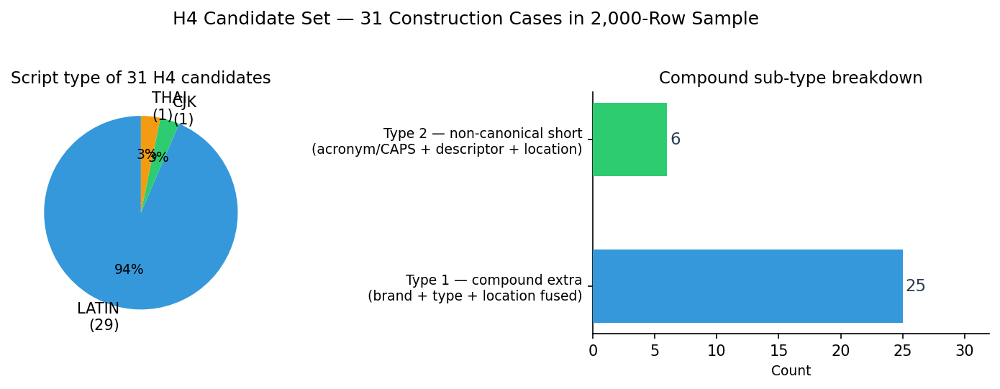
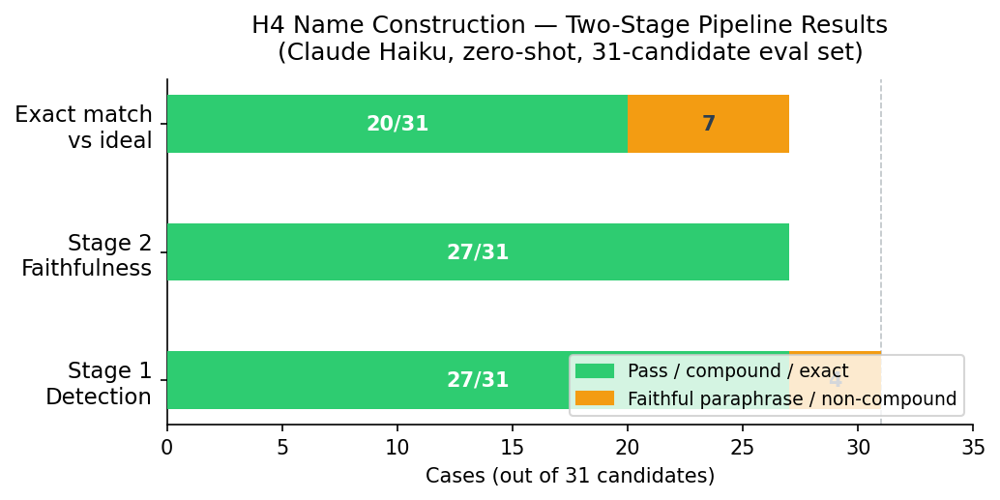
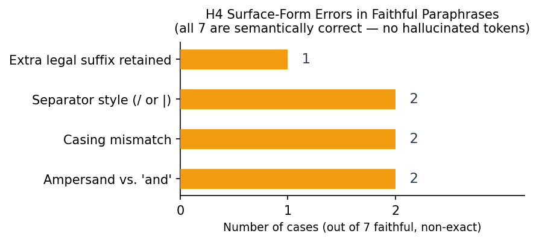

# places-truth-reconciliation

> Building a reliable "golden record" for real-world places by selecting the best attribute values from two competing
> candidate records per place.

---

## Understanding the Dataset

The source file is `data/raw/project_a_samples.parquet`, described in `data/raw/readme_project_a_samples.txt`.

Each row represents a single real-world place with two candidate representations of its attributes. One candidate uses
the prefix `base_`; the other has no prefix (referred to here as `alt`). For each reconcilable attribute — phone,
website, address, category, name, social links, brand, email — the dataset provides a `base_*` value and an `alt` value
that may agree or disagree. The goal is to select the better value for each attribute, or abstain when neither can be
trusted.

Not all columns are reconciliation targets. `confidence` and `sources` are metadata fields: inputs to decision-making
rather than attributes to be selected. `confidence` is defined by the Overture schema as certainty that the place exists
— not that any given attribute is correct. `sources` identifies which upstream provider contributed each record, and is
a candidate feature for scoring but not a target. Both sides always have these fields.

### Column Coverage

Script: `scripts/01_dataset_overview.py`  
Output: `analysis/general/dataset_overview.csv`

| Column     | Alt Coverage | Base Coverage | Notes                                           |
|------------|--------------|---------------|-------------------------------------------------|
| id         | 100%         | 100%          | Row identifiers                                 |
| confidence | 100%         | 100%          | Metadata — place existence certainty            |
| sources    | 100%         | 100%          | Metadata — upstream provider identity           |
| names      | 100%         | 100%          |                                                 |
| addresses  | 100%         | 100%          |                                                 |
| categories | 99.2%        | 99.4%         |                                                 |
| phones     | 94.1%        | 85.0%         | Base missingness is partly string-encoded nulls |
| websites   | 83.3%        | 74.6%         |                                                 |
| socials    | 69.6%        | 50.9%         |                                                 |
| brand      | 35.2%        | 97.7%         | Coverage nearly inverted between sides          |
| emails     | 0.0%         | 10.95%        | Alt has no email data                           |

Two structural asymmetries stand out. Brand coverage is inverted: base has it for 98% of rows while alt has it for only
35%. This reflects a difference in what each provider tracks, not missingness in the usual sense. Emails go the
other direction entirely: alt has no email data while base supplies it for 11% of rows. Both are genuine data
characteristics that affect how reconciliation can work for those attributes.

---

## Exploratory Analysis

### Conflict Rates Across All Attributes

Script: `scripts/02_attribute_coverage_and_conflicts.py`  
Outputs: `analysis/general/attribute_conflict_summary.csv`, `analysis/general/attribute_conflict_breakdown.csv`

The table below shows conflict rates for every attribute in the dataset. A conflict is any row where both sides have a
value and those values disagree.

| Attribute  | Alt Coverage | Base Coverage | Conflict Count | Conflict Rate |
|------------|--------------|---------------|----------------|---------------|
| sources    | 100%         | 100%          | 2000           | 100%          |
| addresses  | 100%         | 100%          | 1722           | 86%           |
| categories | 99%          | 99%           | 1608           | 80%           |
| confidence | 100%         | 100%          | 1558           | 78%           |
| phones     | 95%          | 100%          | 1536           | 77%           |
| names      | 100%         | 100%          | 1375           | 69%           |
| websites   | 86%          | 100%          | 1292           | 65%           |
| socials    | 70%          | 51%           | 858            | 43%           |
| brand      | 35%          | 98%           | 389            | 19%           |
| emails     | 0%           | 50%           | 0              | 0%            |

`sources` conflicts at 100% by construction — the two sides always cite different providers. This is expected and not
meaningful as a conflict. `confidence` conflicting at 78% reflects the same: the two aggregation pipelines produce
different existence scores. Neither is a reconciliation target.

Among the reconcilable attributes, disagreement is high across the board. Addresses lead at 86%, but even brand — the
attribute with the most skewed coverage — still conflicts in 19% of rows. This is a dataset where the two sides
routinely
disagree, not one where one side is a reliable fallback.

**Disagreement is primarily semantic, not a coverage problem.** For addresses and categories, both sides have a value
in virtually every conflict row — they simply disagree on what that value is.

### Source Providers

Script: `scripts/03_source_providers.py`  
Outputs: `analysis/general/source_provider.csv`, `analysis/general/source_provider_pairings.csv`,
`analysis/general/source_property_values.csv`, `analysis/general/source_attr_contributors_per_row.csv`

The `sources` and `base_sources` fields identify which upstream provider contributed each record. Provider identity is a
candidate feature for reconciliation scoring: if certain providers systematically produce more reliable values for
specific attributes, that becomes a useful signal. Validating that hypothesis requires ground-truth labels and is
deferred to the feature engineering phase.

`source_provider.csv` shows which provider contributed attribute data per side:

| Side | Dataset    | Row Count | Row % |
|------|------------|-----------|-------|
| alt  | meta       | 1392      | 69.6% |
| alt  | Microsoft  | 466       | 23.3% |
| alt  | msft       | 142       | 7.1%  |
| base | FourSquare | 1000      | 50.0% |
| base | Microsoft  | 950       | 47.5% |
| base | msft       | 33        | 1.65% |
| base | meta       | 17        | 0.85% |

Alt attribute data comes almost entirely from meta. Base is split evenly between FourSquare and Microsoft.
`source_provider_pairings.csv` shows the combinations:

| Base Provider | Alt Provider | Row Count | Row % |
|---------------|--------------|-----------|-------|
| FourSquare    | meta         | 843       | 42.2% |
| Microsoft     | meta         | 525       | 26.3% |
| Microsoft     | Microsoft    | 309       | 15.5% |
| FourSquare    | Microsoft    | 157       | 7.9%  |
| Microsoft     | msft         | 116       | 5.8%  |

---

## Phone Attribute Analysis

Before designing reconciliation logic for phones, we separate four concerns and analyze each independently to avoid
conflating formatting noise with semantic disagreement.

### 1. Missingness

Script: `scripts/phones/04_phone_missingness.py`  
Output: `analysis/phones/phone_missingness_summary.csv`, `analysis/phones/phone_null_normalization_impact.csv`

This table measures how often phone values are actually absent versus encoded as string-wrapped null markers.

| Column                 | Meaning                                             | Base Count | Alt Count |
|------------------------|-----------------------------------------------------|------------|-----------|
| `total_rows`           | Total candidate rows evaluated per source           | 2000       | 2000      | 
| `sql_null`             | True SQL NULL values                                | 4          | 109       |
| `bracket_null`         | Exact string `[null]`                               | 288        | 0         |
| `bracket_empty_string` | Exact string `[""]`                                 | 8          | 10        |
| `bracket_null_caps`    | Exact string `["NULL"]`                             | 1          | 0         |
| `bracket_null_lower`   | Exact string `["null"]`                             | 0          | 0         |
| `contains_null_text`   | Any non-null string containing the substring `null` | 289        | 0         |

**Interpretation**: **Null normalization resolves 206 false conflicts.** Before unifying null encodings, 1536 rows
appear as conflicts because the raw strings differ. Of these, 200 have a real phone on the alt
side but a bracket-wrapped null marker (`[null]`, `[""]`) on the base side, and 6 have the
reverse pattern. After unification, these are correctly reclassified as one-sided rows rather
than conflicts.

### 2. Structure and Formatting

Script: `scripts/phones/05_phone_structure.py`  
Outputs: `analysis/phones/phone_structure_summary.csv`, `analysis/phones/phone_digit_length_distribution.csv`

This table evaluates formatting behavior **only for usable values**  
(defined as non-null strings containing at least one digit).

| Column                  | Meaning                            | Base Count | Alt Count |
|-------------------------|------------------------------------|------------|-----------|
| `usable_rows`           | Rows containing at least one digit | 1699       | 1881      |
| `has_plus_count`        | Contains `+` country prefix        | 13         | 1283      |
| `has_parentheses_count` | Contains parentheses               | 267        | 0         |
| `has_hyphen_count`      | Contains hyphen separators         | 329        | 0         |
| `pure_numeric_count`    | String consists only of digits     | 978        | 598       |
| `too_short_count`       | Digit length < 7                   | 0          | 0         |
| `too_long_count`        | Digit length > 15                  | 0          | 0         |

The two sides use systematically different formatting conventions. Alt uses E.164 format (`+` prefix) in 68% of rows.
Base uses local formatting (parentheses, hyphens, spaces) and almost never uses a `+` prefix. This means raw string
comparison will treat identical numbers as conflicts whenever they differ only in format.

**Interpretation**: Structural validity is generally high, but the two sides use systematically different formatting
conventions. Pure string comparison overestimates disagreement due to this variation.

This table buckets usable phone numbers by digit length.

| Bucket  | Meaning                 | Base Count | Alt Count |
|---------|-------------------------|------------|-----------|
| `<7`    | Likely malformed        | 0          | 0         |
| `7-9`   | Possibly local formats  | 90         | 28        |
| `10`    | Standard US format      | 1297       | 528       |
| `11`    | Country code + US       | 215        | 936       |
| `12-15` | International formats   | 97         | 389       |
| `>15`   | Implausible / malformed | 0          | 0         |

Digit length distribution shows that the vast majority of usable numbers fall in the 10–12 digit range with no evidence
of systemic corruption (no values below 7 or above 15 digits).

**Interpretation**: The majority of usable numbers fall within plausible bounds. No evidence of systemic
extreme-length corruption. Digit normalization is required before reconciliation.

#### 3. Normalization Impact

Script: `scripts/phones/06_phone_normalization.py`  
Outputs: `analysis/phones/phone_normalization_impact_staged.csv`, `analysis/phones/phone_remaining_conflicts.csv`

This is the core phone analysis. We apply progressively stronger normalization rules and measure how apparent conflict
drops at each stage.
Each stage is monotonic.

| Stage | Rule                              | Conflict Count | Conflict Rate | Improvement vs Prior |
|-------|-----------------------------------|----------------|---------------|----------------------|
| S0    | Null normalization (preamble)     | —              | —             | —                    |
| S1    | Raw string compare                | 1330           | 79.17%        | —                    |
| S2    | Strip non-digits; exact match     | 1261           | 75.06%        | 5.19%                |
| S3    | US: +1 leading digit vs 10-digit  | 819            | 48.75%        | 35.05%               |
| S4    | Generic 1-digit CC drop           | 765            | 45.54%        | 6.59%                |
| S5    | Trunk 0 vs 2-digit CC             | 554            | 32.98%        | 27.58%               |
| S6    | Trunk 0 vs 3-digit CC             | 478            | 28.45%        | 13.72%               |
| S7    | 2-digit CC vs national (no trunk) | 425            | 25.30%        | 11.09%               |
| S8    | 3-digit CC vs national (no trunk) | 417            | 24.82%        | 1.88%                |
| S9    | CC2+0+national vs CC2+national    | 402            | 23.93%        | 3.60%                |

Percentages are based on 1,680 usable rows (both sides have at least one digit). Of the remaining 320 rows: 100 have
no phone on either side, and 220 have a phone on only one side (201 alt-only, 19 base-only).

Remaining conflicts after all stages are exported for manual review in
`analysis/phones/phone_remaining_conflicts.csv` with a `conflict_type` column: `both_present` (402 rows), `alt_only` (
201 rows), and `base_only` (19 rows).

**Interpretation**

- **Raw string comparison overstates phone conflict by approximately 3.3x.** After applying
  region-agnostic normalization rules, apparent conflict drops from 79% to 24%.
  - The S1 baseline of 1330 conflicts (79.2%) in the normalization pipeline already
    benefits from null normalization — the true pre-normalization conflict rate is 1536 (91.4% of
    the 1680 usable rows), making the actual overstatement factor approximately **3.8x** rather than 3.3x.
- **The largest single improvement (S3, ~35%) comes from US +1 prefix normalization**, reflecting
  the dataset's heavy US representation and a systematic formatting difference between the two
  sides (E.164 vs bare national number).
- **International trunk-prefix normalization (S5–S6) accounts for ~37% combined reduction**,
  addressing the common pattern where one source stores a country code prefix while the other
  stores a local trunk-dialed number.
- **The remaining ~24% (402 pairs) represent genuinely different phone numbers.** These are true
  semantic conflicts requiring reconciliation logic

This staged approach serves as a template for normalization analysis on other attributes (websites, addresses)
where similar encoding differences between aggregation strategies may inflate apparent conflict.

#### 4. Confidence Analysis

Script: `scripts/phones/07_phone_confidence.py`  
Outputs: `analysis/phones/phone_true_conflict_confidence_summary.csv`,
`analysis/phones/phone_true_conflict_confidence_detail.csv`, `analysis/phones/phone_confidence_distribution.csv`,
`analysis/phones/phone_confidence_distribution_bucketed.csv`

Per the [Overture schema](https://docs.overturemaps.org/schema/reference/places/place/),
`confidence` is defined as "the confidence of the existence of the place" - a score between
0 and 1 reflecting how sure the system is that the place itself is real and currently
operating. It is not a measure of individual attribute quality, completeness, or
correctness. This distinction is critical: a place can have high existence confidence and
still have a missing or incorrect phone number.

After normalization, we test whether confidence scores can resolve the remaining 622 phone conflicts (402 true
conflicts + 220 one-sided). They cannot.

**Base confidence is effectively binary.** Within the 402 true conflicts, `phone_confidence_distribution.csv` shows:

| Side | Confidence Value | Row Count | % of Class |
|------|------------------|-----------|------------|
| base | 1.0              | 234       | 58.2%      |
| base | 0.77             | 159       | 39.6%      |
| base | (all others)     | 9         | 2.2%       |

98% of base confidence scores in true conflicts are either exactly 1.0 or exactly 0.77. This is not a granular quality
measure — it is a two-state flag that cannot meaningfully rank one record against another.

Alt confidence has more spread (24 distinct values) but still clusters heavily at 0.77. `phone_confidence_distribution_bucketed.csv` shows:

|  Confidence Bucket | Row Count | % of Class |
|--------------------|-----------|------------|
| **1.00**           | **56**    | **13.9%**  |
| 0.99              | 29        | 7.2%       |
| 0.98              | 37        | 9.2%       |
| 0.97 – 0.95        | 52        | 12.9%      |
| 0.94 – 0.92        | 10        | 2.5%       |
| 0.91 – 0.89        | 8         | 2.0%       |
| 0.88 – 0.86        | 4         | 1.0%       |
| 0.85 – 0.78        | 20        | 5.0%       |
| **0.77**           | **133**   | **33.1%**  |
| 0.76 – 0.60        | 11        | 2.7%       |
| 0.59 – 0.00        | 42        | 10.4%      |

**Base confidence is higher most of the time, regardless of correctness.** `phone_true_conflict_confidence_summary.csv` shows that in the 402 true conflicts:

| Side Higher | Count | % of Rows |
|-------------|-------|-----------|
| base        | 241   | 60.0%     |
| tied        | 89    | 22.1%     |
| alt         | 72    | 17.9%     |

Base scores higher in 60% of rows — but since base clusters at 1.0 by construction, this tells us nothing about which phone number is correct.

**Confidence gaps are too small to be useful.** The median absolute confidence gap across the 402 true conflicts is 0.055, and 48% of rows have a gap of 0.05 or less:

| Confidence Gap | Row Count | % of True Conflicts |
|----------------|-----------|---------------------|
| ≤ 0.05         | 193       | 48.0%               |
| 0.06 – 0.10    | 23        | 5.7%                |
| 0.11 – 0.20    | 14        | 3.5%                |
| > 0.20         | 172       | 42.8%               |

Nearly half of all true conflicts have gaps so small they are effectively tied. The 42.8% with gaps above 0.20 might seem actionable, but since base clusters at 1.0 those large gaps mostly just reflect base's fixed anchor value, not a meaningful quality difference.

**Higher confidence does not mean more data.** In the 201 alt-only rows where alt provides a phone and base has nothing,
`phone_true_conflict_confidence_summary.csv` shows:

| Conflict Class | Avg Alt Confidence | Avg Base Confidence | Base Higher |
|----------------|--------------------|---------------------|-------------|
| alt_only       | 0.753              | 0.995               | 97.5%       |

The side with no phone number is rated more confident in 97.5% of cases. This is consistent with the schema definition:
confidence measures place existence, not attribute completeness.

**Conclusion for phones**: confidence is not a viable reconciliation signal. Using it as a tiebreaker would
systematically favor the base side due to its clustering at 1.0, with no relationship to phone quality. True conflicts (
402 rows) should default to abstention — phone digits have no evaluable internal structure beyond format validity, so
neither a rule-based nor ML approach can determine correctness without external verification.

---

## Name Attribute Analysis

Before designing reconciliation logic for names, we separate three concerns and analyze each independently:
structural characteristics of raw name values, conflict classification using a two-tier labeling system, and
Unicode normalization correctness. Names have 100% coverage on both sides (no missingness analysis needed),
so the focus is entirely on characterizing disagreement.

### 1. Structure and Formatting

Script: `scripts/names/08_name_structure.py`  
Outputs: `analysis/names/name_structure_summary.csv`, `analysis/names/name_length_distribution.csv`,
`analysis/names/name_wordcount_distribution.csv`, `analysis/names/name_casing_summary.csv`

This table measures structural characteristics of name values per side, independent of whether they agree.

| Metric              | Alt    | Base   |
|---------------------|--------|--------|
| Total rows          | 2000   | 2000   |
| Avg length (chars)  | 20.4   | 21.0   |
| Median length       | 18.0   | 19.0   |
| Min / Max length    | 2 / 90 | 2 / 89 |
| Avg word count      | 3.01   | 3.09   |
| All-caps names      | 39 (1.95%) | 69 (3.45%) |
| All-lower names     | 18 (0.9%)  | 15 (0.75%) |
| Business suffix     | 68 (3.4%)  | 71 (3.55%) |
| SEO keywords        | 16 (0.8%)  | 15 (0.75%) |
| Excessive (>8 words)| 19 (0.95%) | 23 (1.15%) |

The two sides are structurally similar. Both cluster around 2–3 word names of 18–21 characters. Base has
slightly more all-caps names (3.5% vs 2.0%), which reflects formatting conventions in certain upstream
providers.

**Business suffixes** (3.4% alt, 3.6% base) detect legal entity markers appended to business names:
`LLC`, `Inc`, `Corp`, `GmbH`, `SRL`, `s.r.l.`, `Ltd`, etc. Examples: `Dana Stampi s.r.l.` vs
`Dana Stampi SRL`, `Aspen Grove - Kitchen & Bath Inc.` vs `Aspen Grove Kitchen & Bath Inc`. These
per-side counts measure how often each source includes legal suffixes, independent of whether the
other side agrees. When one side has a suffix and the other doesn't, it typically creates a subset
conflict (e.g. `Emerson Fence Inc` vs `Emerson Fence`).

**SEO keywords** (0.8% alt, 0.75% base) detect marketing/directory junk injected into name fields:
`hours`, `address`, `near me`, `official site`, `directions`, `reviews`, `menu`. Example:
`Harrah's Casino New Orleans: Hours, Address` vs `Harrah's`. These are rare but unambiguously noise —
the side with SEO keywords is never the preferred name.

**Excessive length** (>8 words; 0.95% alt, 1.15% base) flags names that may contain embedded
descriptions, addresses, or listing boilerplate. Examples include
`DANCENTER (39879) 6 Personen Ferienhaus in einem Ferienpark in Hanstholm` (vacation rental listing
template with unit ID) and `HWV Hanseatische Wirtschafts- und Vertriebsgesellschaft für Ärztebedarf
R. Blome GmbH` (full legal entity name). Excessive length is not inherently noise — long German company
names are legitimate — but it correlates with listing boilerplate that inflates apparent conflict.

Character length distribution (`name_length_distribution.csv`) confirms the bulk falls in the 11–35 character
range (71% alt, 69% base), with a thin tail beyond 50 characters:

| Bucket | Alt     | Base    |
|--------|---------|---------|
| 1–5    | 3.6%    | 3.75%   |
| 6–10   | 15.4%   | 15.95%  |
| 11–20  | 38.85%  | 36.0%   |
| 21–35  | 32.35%  | 32.9%   |
| 36–50  | 7.75%   | 8.85%   |
| 51–75  | 1.9%    | 2.25%   |
| >75    | 0.15%   | 0.3%    |

Word count distribution (`name_wordcount_distribution.csv`) shows that 1–3 word names dominate (69% alt,
68% base), with names beyond 5 words accounting for under 10%:

| Words | Alt     | Base    |
|-------|---------|---------|
| 1     | 19.15%  | 17.6%   |
| 2     | 25.05%  | 25.65%  |
| 3     | 25.2%   | 24.85%  |
| 4     | 13.55%  | 13.3%   |
| 5     | 8.1%    | 8.25%   |
| 6+    | 8.95%   | 10.35%  |

**Interpretation**: The two sides produce structurally similar name values. There is no systematic
length or complexity asymmetry that would favor one side over the other as a formatting signal.

### 2. Conflict Classification — Two-Tier Labeling

Script: `scripts/names/08_name_structure.py`  
Outputs: `analysis/names/name_agreement_breakdown.csv`, `analysis/names/name_all_agreements_labeled.csv`,
`analysis/names/name_tier1_summary.csv`, `analysis/names/name_subtag_summary.csv`,
`analysis/names/name_all_conflicts_labeled.csv`, `analysis/names/name_genuinely_different_inspect.csv`

The `names` and `base_names` fields are JSON objects containing a `primary` name and optionally
alternate or common names. This analysis focuses on the **primary name** only — the most important
field for reconciliation. The 2000 rows break down as follows
(`name_agreement_breakdown.csv` has 3 examples per bucket with full JSON):

| Bucket                          | Rows | % of Total | Meaning                                      |
|---------------------------------|------|------------|----------------------------------------------|
| `full_agreement`                | 625  | 31.3%      | Entire JSON matches — no conflict at all      |
| `primary_agrees_json_differs`   | 292  | 14.6%      | Primary names match; JSON envelope differs (empty fields) |
| `primary_conflict`              | 1083 | 54.2%      | Primary names disagree — this is what we classify below |

These buckets use **raw string comparison with no normalization**. A row lands in `primary_conflict`
if the extracted primary name strings differ at all — including pure casing differences like
`ROSSMANN` vs `Rossmann`. The Tier 1 classifier below determines which of the 1083 are real
semantic conflicts versus formatting noise.

The 292 `primary_agrees_json_differs` rows are entirely a JSON serialization difference — the base
side includes empty structural fields that the alt side omits. For example:

- alt: `{"primary":"Edward Jones"}`
- base: `{"primary":"Edward Jones","common":{},"rules":[]}`

All 292 rows follow this pattern. There is no actual name data difference in any of them.

`name_all_agreements_labeled.csv` contains every row from the first two buckets (917 rows) with
agreement type, both primary names, both full JSON objects, address, and confidence — the
counterpart to `name_all_conflicts_labeled.csv`. Together the two files account for all 2000 rows.

The 292 `primary_agrees_json_differs` rows require no reconciliation action — the name data is
identical, only the JSON envelope differs. The remaining 1083 primary-name conflicts are classified
using a two-tier system designed for reconciliation decision-making.

#### Tier 1: Relationship Type

Tier 1 labels are mutually exclusive and determine the reconciliation action.

| Tier 1 Label              | Meaning                                                         | Reconciliation Action          |
|---------------------------|-----------------------------------------------------------------|--------------------------------|
| `casing_only`             | Identical after lowercasing                                     | Auto-resolve; formatting pref  |
| `normalization_equivalent`| Same name after punctuation/spacing/diacritic/conjunction/spelling/script-form normalization | Auto-resolve; formatting pref  |
| `subset`                  | One name is meaningfully contained in the other (brand vs brand+branch, name vs name+gloss) | Policy decision: prefer core name vs full listing |
| `genuinely_different`     | Different names for the same place, or potential bad match       | Requires human review or abstention |

The distribution across 1083 conflict rows:

| Tier 1 Label              | Count | % of Conflicts |
|---------------------------|-------|----------------|
| `subset`                  | 602   | 55.6%          |
| `normalization_equivalent`| 234   | 21.6%          |
| `genuinely_different`     | 189   | 17.5%          |
| `casing_only`             | 58    | 5.4%           |

Over 82% of name conflicts (casing + normalization + subset) have a deterministic or policy-based
resolution path. Only 17.5% are genuinely different names requiring human review.

#### How Tier 1 Classification Works

Classification operates as a **decision tree**: each conflict row is checked against the Tier 1
labels in priority order, and the first label that matches is assigned. This is different from the
phone analysis, which applied a staged monotonic pipeline and measured conflict reduction at each
step. Here, each row gets exactly one label and stops. (The monotonic pipeline in Section 6
applies a similar staged approach to names and measures cumulative conflict reduction.)

The decision tree has four steps. Step 1 is a single check. Step 2 runs through 9 progressively
stronger normalizers — if *any* of them produce a match, the row is labeled and we stop. Steps 3
and 4 are single checks.

**Step 1 — Casing only.** If `lower(alt) == lower(base)`, the row is `casing_only` and we stop.
Example: `ROSSMANN` vs `Rossmann`.

**Step 2 — Normalization equivalent.** We apply progressively stronger normalizations to both names
and check whether any of them produce a match. Each normalizer builds on `norm_compare` (the
standard comparison form), which applies: fullwidth→ASCII conversion, Latin accent stripping,
lowercasing, punctuation/symbol removal, and whitespace collapsing. The normalizers are checked in
order from cheapest to most expensive — if any one matches, the row is `normalization_equivalent`
and we stop.

In the table below, the three-part arrow notation `A` → `normalized` ← `B` shows both inputs
normalizing to the same middle form. The two-part notation `A` ↔ `B` means the two match after
normalization without showing the intermediate form.

| # | Check                         | What it catches                                              | Example                                                        |
|---|-------------------------------|--------------------------------------------------------------|----------------------------------------------------------------|
| 1 | `norm_compare` match          | Case, accents, punctuation differences                       | `Origen's Bistrô` → `origens bistro` ← `origensbistro`        |
| 2 | Space-stripped match           | Compound split/join                                          | `Photo Color Lab` → `photocolorlab` ← `PhotoColorLab`         |
| 3 | Conjunction-normalized         | `&`/`and`/`et`/`und`/`y`/`e` unified                       | `Acqua e Sapone` → `acqua and sapone` ← `Acqua & Sapone`     |
| 4 | Conjunction + space-stripped   | Conjunction + compound boundary                              | `Crepes&Coffee` → `crepesandcoffee` ← `Crepes & Coffee`       |
| 5 | Spelling-normalized            | British/American variants                                    | `Defence Centre` → `defense center` ← `Defense Center`        |
| 6 | Word-reorder (sorted tokens)   | Same words in different order                                | `Colombo Cristoforo` → `colombo cristoforo` ← `Cristoforo Colombo` |
| 7 | Katakana→hiragana              | Japanese script-form variants (see note below)               | `コインランドリーハナコ` → `こいんらんどりーはなこ` ← `コインランドリーはなこ` |
| 8 | Katakana→hiragana + space-stripped | Script-form + Japanese compound boundary                 | Same as 7 but also collapses spacing differences               |
| 9 | Levenshtein typo (see note below) | 1–2 character substitutions/insertions                    | `คลีนิคบ้านหมอ` ↔ `คลีนิกบ้านหมอ` (Thai spelling variant)    |

**Stages 7–8: Katakana and hiragana.** Japanese has two phonetic scripts — katakana (カタカナ) and
hiragana (ひらがな) — that represent the same sounds with different characters. A business name
written in katakana and the same name written in hiragana are the same name, just in different
scripts. This is analogous to writing "HELLO" vs "hello" in English, except the character sets are
entirely different. `コインランドリーハナコ` (katakana) and `コインランドリーはなこ` (hiragana)
both read "Coin Laundry Hanako." The normalizer converts all katakana to hiragana before comparing.
Stage 8 additionally strips spaces to handle Japanese compound word boundaries (see Step 3 below).

**Stage 9: Levenshtein thresholds.** The typo detector uses edit distance ≤ 2 with a similarity
ratio ≥ 0.85 (computed as `1 − distance / max_length`), and only fires on strings of 5+ characters.
These thresholds are conservative: edit distance 2 catches single transpositions, a dropped letter,
or a substitution (like Thai `ค` vs `ก`), while the 0.85 similarity floor prevents short strings
from false-matching (a 1-character edit on a 5-character string is only 0.80 similarity and would be
rejected). The 5-character minimum avoids trivially matching short words. Typo detection is the last
check because it is the most expensive (quadratic in string length) and the least precise.

**Step 3 — Subset.** If one name is meaningfully contained inside the other, the row is `subset`.

**Step 4 — Genuinely different.** If none of the above matched, the row is `genuinely_different`.
Example: `ก๋วยเตี๋ยวปลาในตำนาน` (Legendary fish noodles) vs `ก๋วยเตี๋ยวปลาสด` (Fresh fish
noodles) — different words, different business names.

#### Why Two Tiers?

Tier 1 answers **"what do we do with this conflict?"** — it maps directly to a reconciliation
action. `casing_only` and `normalization_equivalent` are auto-resolvable. `subset` is a policy
decision. `genuinely_different` requires human review.

Tier 2 answers **"what kind of difference is it?"** — it is diagnostic. Tier 2 explains *why* conflicts exist in the
data (punctuation conventions differ between providers, Japanese listings include branch suffixes, etc.).
Tier 2 subtags are also candidates for feature engineering if an ML approach is pursued later.

#### Tier 2: Transformation Subtags

Tier 2 subtags are diagnostic — multiple can apply per row. They describe *what kind* of
transformation explains the difference, not the reconciliation action.

**For `normalization_equivalent` rows:**

| Subtag        | Meaning                                                          |
|---------------|------------------------------------------------------------------|
| `punctuation` | Dash/dot/apostrophe/quote/nakaguro (・) differences              |
| `spacing`     | Compound split/join (PhotoColorLab ↔ Photo Color Lab)            |
| `diacritic`   | Accent differences (Bistrô ↔ Bistro, Creatività ↔ Creativita)   |
| `conjunction` | &/and/et/und/y/e interchange                                     |
| `spelling`    | British/American variants (centre ↔ center)                      |
| `word_reorder`| Same tokens in different order                                   |
| `script_form` | Katakana ↔ hiragana (ハナコ ↔ はなこ), small kana variants       |
| `typo`        | Levenshtein distance ≤ 2 (only when no other subtag explains it) |

**For `subset` rows:**

| Subtag           | Meaning                                                        |
|------------------|----------------------------------------------------------------|
| `branch_suffix`  | Brand + store/location name (very common in JP/TH data)        |
| `parenthetical`  | Name + parenthetical reading/disambiguation                    |
| `biz_suffix`     | Legal suffix added/removed (LLC, GmbH, SRL, Inc, ...)         |
| `seo_junk`       | SEO keywords in the longer name (hours, directions, near me)   |
| `facility_suffix` | Bus stop, ATM, substation appended                            |
| `descriptor`     | Additional business description (catch-all)                    |


**How subset subtags are detected:** For each subset row, the script identifies the "excess" —
the content the longer name adds beyond the shorter name — and checks it against specific patterns
in priority order:
 
1. **`parenthetical`**: The longer name has parentheses/brackets that the shorter name doesn't.
2. **`biz_suffix`**: The longer name ends with a legal suffix the shorter doesn't
   (`LLC`, `Inc`, `GmbH`, `SRL`, `s.r.l.`, `Corp`, `Ltd`, `Pty`, `AG`, etc.).
3. **`seo_junk`**: The longer name contains SEO keywords the shorter doesn't
   (`hours`, `address`, `near me`, `directions`, `reviews`, `menu`).
4. **`branch_suffix`**: The excess content matches branch/location keywords:
   - Japanese: `店` (store), `支店` (branch), `出張所` (sub-office), `営業所` (office),
     `イオン` (Aeon), `モール` (mall), `マルイ` (Marui)
   - Thai: `สาขา` (branch), `ถนน` (road), `ซอย` (soi/alley), `ต.`/`อ.`/`จ.` (sub-district/district/province)
   - English: `branch`, `store`, `outlet`, `location`, `mall`, `plaza`, `center`, `centre`
5. **`facility_suffix`**: The excess matches facility keywords: `バス停` (bus stop), `bus stop`,
   `atm`, `cash machine`, `substation`.
6. **`descriptor`**: Catch-all. If no other subtag fires, the excess is labeled `descriptor`.
   This accounts for 74% of subsets because most extra content (location names, department names,
   service descriptions, owner names) doesn't contain any of the specific keywords above. The
   keyword lists are intentionally conservative — better to land in the catch-all than to
   false-classify.

Subtag frequency from `name_subtag_summary.csv` (counts may exceed Tier 1 totals because rows can
carry multiple subtags):

**Normalization subtags** (234 rows; percentages reflect how many rows carry each subtag,
and can exceed 100% because a single row may carry multiple subtags):

| Subtag        | Count | % of Norm. Rows |
|---------------|-------|-----------------|
| `punctuation` | 85    | 35.7%           |
| `spacing`     | 76    | 31.9%           |
| `typo`        | 33    | 14.1%           |
| `word_reorder`| 26    | 10.9%           |
| `diacritic`   | 19    | 8.0%            |
| `conjunction` | 15    | 6.3%            |
| `script_form` | 1     | 0.4%            |
| `spelling`    | 1     | 0.4%            |

Punctuation and spacing dominate normalization conflicts. Typo at 33 rows reflects the long tail
of 1–2 character differences that no other normalizer catches (Thai spelling variants, small kana,
minor letter substitutions). Conjunction and diacritic differences are present but less common.
Script-form and British/American spelling variants are rare in this sample.

**Subset subtags** (602 rows):

| Subtag           | Count | % of Subset Rows |
|------------------|-------|------------------|
| `descriptor`     | 444   | 73.8%            |
| `biz_suffix`     | 52    | 8.7%             |
| `branch_suffix`  | 46    | 7.7%             |
| `parenthetical`  | 36    | 6.0%             |
| `facility_suffix`| 29    | 4.8%             |
| `seo_junk`       | 1     | 0.2%             |

The `descriptor` catch-all accounts for 74% of subsets, reflecting the wide variety of ways one
source adds context to a core name (branch numbers, department names, service lists, owner names).
`biz_suffix` (LLC, GmbH, etc.) and `branch_suffix` (Japanese/Thai store names) are the next most
common. `facility_suffix` catches appended bus stop (バス停) and ATM designations. SEO junk is
negligible in name data — note that some SEO-flagged words like "menu" or "best" can also be
legitimate parts of a business name (e.g., a restaurant called "Best Menu"). These false positives
are not a problem because the SEO flag is diagnostic only; actual SEO-stuffed names are caught
as subsets when the shorter side contains the core name without the keywords.

#### Output Files

`name_tier1_summary.csv` — Count and percentage of each Tier 1 label across all conflict rows.

`name_subtag_summary.csv` — Frequency of each Tier 2 subtag, grouped by its parent Tier 1 label.
Since subtags are semicolon-delimited and a row can carry multiple, counts here may exceed the Tier 1
row count (each subtag is counted independently).

`name_all_conflicts_labeled.csv` — All 1083 conflict rows with `tier1`, `tier2_subtags`, both name
values, length/word-count differentials, address/city/state/category context, confidence scores, and
`sources`/`base_sources` for provider identity analysis. Also includes diagnostic boolean flags
(`alt_has_biz_suffix`, `base_has_seo`, etc.) for downstream feature engineering. Sorted by tier1 →
subtags → length differential for systematic inspection.

`name_genuinely_different_inspect.csv` — The subset of conflict rows labeled `genuinely_different`.
This is the **golden dataset population** for name reconciliation: the rows where normalization
cannot resolve the conflict and human judgment is required.

### 3. Technical Notes — Multilingual Unicode Handling

**Note 1: Accent stripping must distinguish Latin diacritics from script-essential marks.**

Unicode represents many accented Latin characters as either a precomposed character or as a base letter plus a
combining mark (for example, é can be represented as e + combining acute accent). Stripping combining marks may
remove Latin accents as intended, but it can also remove marks that are linguistically meaningful in other scripts.

In Japanese, the dakuten (`゛`) indicates voicing. In Unicode, this may be represented either as a precomposed character like
`バ` or as a base kana plus the combining dakuten (`バ` = `ハ` + `U+3099`). Removing the dakuten changes `バ` (ba) to `ハ` (ha),
altering pronunciation and meaning entirely.

In Thai, tone marks (`่ ้ ๊ ๋`) are combining marks, and removing them can change pronunciation and meaning.
For example, `ห้วย` loses its tone mark and becomes `หวย`, changing the word from `creek` or `stream` to `lottery` or `lottery ticket`..
(Thai has five tones, but only four written tone marks; the realized tone also depends on consonant class
and syllable structure, not just the mark.)

More broadly, 99 rows (4.95%) contain script-essential
combining marks that naive accent stripping would destroy: 37 with Japanese dakuten (voicing
marks that distinguish `バ` "ba" from `ハ` "ha"), 10 with handakuten (`パ` vs `ハ`), 47 with Thai tone
marks, and 20 with small kana. The fix is to avoid blanket removal of all combining marks and instead apply a 
conservative Latin-only accent-folding rule, such as stripping marks in the Combining Diacritical Marks block
(`U+0300`..`U+036F`), while leaving script-specific marks intact.

**Note 2: Fullwidth spaces (U+3000) are visually identical to ASCII spaces.**

CJK text commonly uses the fullwidth ideographic space (U+3000) instead of the ASCII space
(U+0020). These render identically in most fonts but are different codepoints. NFKD normalization
converts U+3000 → U+0020, so after normalization both forms are identical. Any subtag detection
or diagnostic logic that operates on already-normalized forms will miss this difference entirely.
The fix is to also check raw forms with whitespace collapsing before checking normalized forms.

**Verification**: 
- The test suite (`test_v2.py`) validates the normalization pipeline against 41
test cases covering all Tier 1 labels, CJK/Thai/Korean scripts, and the patterns described above.
- The script `unicode_accent_audit.py` counts the number of non-Latin accents in the dataset and
outputs it to `name_unicode_mark_counts.csv`.

### 4. Casing Patterns

Script: `scripts/names/08_name_structure.py`  
Output: `analysis/names/name_casing_summary.csv`

Among conflict rows, casing behavior breaks down as:

| Pattern                  | Count | % of Conflicts |
|--------------------------|-------|----------------|
| Both mixed/title case    | 976   | 90.12%         |
| Casing only (no other diff) | 58 | 5.36%         |
| Base all-caps, alt not   | 32    | 2.95%          |
| Alt all-caps, base not   | 6     | 0.55%          |
| Alt all-lower, base not  | 6     | 0.55%          |
| Base all-lower, alt not  | 5     | 0.46%          |

**Interpretation**: 90% of conflicts have mixed or title casing on both sides — casing alone rarely
explains disagreement. The 58 casing-only rows (5.4%) are trivially resolvable. Among the remaining
conflicts with asymmetric casing, base is more likely to be all-caps (2.95% vs 0.55%), consistent with
certain upstream providers storing names in uppercase.

### 5. Manual Inspection — Observations by Conflict Type

The following observations are from manual review of `name_all_conflicts_labeled.csv`, organized by
Tier 1 and Tier 2 labels. Each subsection documents patterns, edge cases, and open questions about
how a normalization pipeline should handle them.

#### Casing Only (58 rows)

Most cases are straightforward: `CVS Pharmacy` vs `CVS pharmacy`, `Honda of Jonesboro` vs
`Honda Of Jonesboro`, `Subway` vs `SUBWAY`. But several raise the question of whether casing is
the owner's stylistic choice:

- `ecoATM` vs `Ecoatm` — the camelCase is intentional branding, compound wordcasing
- `IndianOil` vs `Indianoil`, `PuroClean` vs `Puroclean`, `CockTailz Fine Wine and Spirits` vs `Cocktailz Fine Wine and Spirits` — same pattern
- `OXXO` vs `Oxxo`, `bp` vs `BP` — all-caps/lowercase is the brand identity

Language-specific casing conventions add further complexity. French and Italian articles and
prepositions are conventionally lowercased in names: `Fleurs d'Alain` vs `Fleurs D'Alain`,
`Osteria del Tempo Perso` vs `Osteria Del Tempo Perso`. These follow grammar rules, not owner
preference. In Japanese, Western brand text tends to be uppercase by convention:
`セルフ写真館BLANC` vs `セルフ写真館Blanc`.

How do we know when capitalization is an abbreviation versus a stylistic choice? There is no
reliable automated signal for this. A rule that "prefers capitalization" when the word is less than 4 letters 
works great, but a rule that "prefer title case" when the word is 5 letters or longer would silently damage branded
names like `ecoATM`.

In such a case, an additional rule that "prefers lowercase->uppercase transition" fixes many situations like `ecoATM` vs `Ecoatm`, 
but it is not perfect; it creates three edge cases (false positives), e.g. `DelMoro Supermarket`, `TerasCorner`, and `NovaCordis`,
when `Del Moro Supermarket`, `Teras Corner`, and `Nova Cordis` are correct.

**Pipeline action (S1)**: Lowercase both sides for comparison. This resolves all 58 casing-only
conflicts but does not preserve owner-stylized casing (`ecoATM`, `IndianOil`) or language-specific
conventions (`d'`/`del`). These are acknowledged as information loss during comparison — the golden
selection rules in Section 7 recover the preferred casing when picking between the two raw names.

#### Normalization Equivalent — Conjunction (15 rows)

The conjunction normalizer works well. Open question: should the golden record prefer `&` universally,
or preserve the original language's conjunction (`e` in Italian, `y` in Spanish, `und` in German)?

One approach: use the language of the name attribute rather than GPS coordinates. A French-language
name in Texas should still use `et` if that is what the business uses. GPS coordinates can help as a
tiebreaker when the name language is ambiguous, but should not override name-level language signals.

**Pipeline action (S5):** Unify `&`/`and`/`et`/`und`/`y`/`e` → canonical form for comparison.
Resolves: `Howarth Timber and Building Supplies` ↔ `Howarth Timber & Building Supplies`,
`Acqua e Sapone` ↔ `Acqua & Sapone`. Note: conjunction insertion/deletion
(`Bäckerei Konditorei` vs `Bäckerei & Konditorei`) is not handled — only substitution is normalized.
Proposal: golden dataset should prefer the canonical form.

#### Normalization Equivalent — Diacritic (19 rows)

Clear cases: `Imobiliária Alegro` vs `Imobiliaria Alegro` or `Café de l'Harmonie` vs `Cafe de l'Harmonie`
— accent should be preserved in languages that use it. The edge case is the reverse: English names that borrow accented words as stylization,
like `Wildberry Pancakes and Café` vs `Wildberry Pancakes and Cafe`. The accent is preserved in both cases because the selection
rule prefers the form with more linguistic information, regardless of whether the accent is
grammatically required or stylistically chosen.

Proposed approach for the golden dataset: if the surrounding name text is in a language that uses the accent, keep it
(`Café` in a French name). If the name is English with a borrowed word, the owner may have chosen
either form. As with conjunctions, the name's own language is a stronger signal than GPS. If an
Italian café uses English branding with an accented `Café`, that may be intentional stylization
that cannot be resolved without owner input.

**Pipeline action (S2):** Strip Latin diacritics for comparison (`é` → `e`), plus fullwidth-to-
halfwidth conversion (`ａ` → `a`, fullwidth space → ASCII space). Diacritics are stripped only
for matching — the golden selection rules in Section 7 prefer the accented form.

#### Normalization Equivalent — Punctuation (85 rows)

This is the most rule-friendly category. Observations by punctuation type:

**Dashes as separators**: Very common, easily normalized. `Farmers Insurance - David Hiney` vs
`Farmers Insurance David Hiney`, `Maricopa County Sheriff's Office - District III Substation` vs
`Maricopa County Sheriff's Office District III Substation`. Standard: drop separator dashes.
But dashes *within* compound words may reflect owner's choice: `A-1 Dental` vs `A1 Dental`, `Grill-Ecke` vs `Grillecke` (German
compound).

**Abbreviation dots**: `Dana Stampi s.r.l.` vs `Dana Stampi SRL`, `D.P.T.` vs `DPT`. Standard:
strip dots from abbreviations. Cultural note: `s.r.l.` is the conventional Italian form, `SRL` is
the database-normalized form. Keeping dots vs stripping is a formatting preference.

**Apostrophes**: Should be preserved — they carry meaning. `Aherne's` vs `Ahernes`, `Fredson's`
vs `Fredsons`, `L'ynara Brautmode` vs `Lynara Brautmode`, `Dunkin' Donuts` vs `Dunkin Donuts`.
Proposal: prefer the form with the apostrophe.

**Quotation marks**: Not enough examples. `Centro Aperto Polivalente per minori "LOL"` vs
`Centro Aperto Polivalente per Minori Lol`, `Friseur Salon "Zur alten Wache"` vs
`Friseur Salon "Alte Wache"` (the quotes are incidental — the real difference is the name inside
them, making this genuinely different).

**Plus signs and special characters**: `Gas` vs `Gas+`, `PostalAnnex+` vs `PostalAnnex`,
`Brothers Mechanical Services` vs `Brothers Mechanical Services®`. These are branding elements.
Standard: strip `+`, `®`, `™` for normalization but flag as owner-decided for the golden record.
Proposal for the golden dataset: strip because a high majority is noise.

**Exclamation marks**: `Maloserá` vs `Maloserá!` — likely owner's stylistic choice. Not enough data to tell. Likely keep.

**Japanese nakaguro (・)**: `ビジネスホテル・キャッスル` vs `ビジネスホテルキャッスル` — the
nakaguro separates loanwords in katakana. Both forms are standard. Standard: strip for comparison,
prefer the nakaguro form in the golden record as it aids readability.

**Pipeline action (S3):** Remove dashes, dots, quotes, nakaguro, `®`, `™`, `+`, `!` and collapse
whitespace. Apostrophes are preserved — they carry linguistic meaning. This is the second-largest
single improvement in the pipeline (6.59%).

#### Normalization Equivalent — Spacing (76 rows)

Generally clean. Compound split/join cases are well-handled: `Photo Color Lab` ↔ `PhotoColorLab`,
`Dance 4 Life` ↔ `Dance4Life`, `からみそラーメン ふくろう` ↔ `からみそラーメンふくろう`.

**Pipeline action (S4):** Strip all spaces and compare. This is the largest single improvement in
the pipeline (7.27%), reflecting the dataset's heavy Japanese and English representation where word
boundary conventions differ between sources. Proposal for golden dataset: squish English together.

#### Normalization Equivalent — Typo (37 rows)

Open question: could a typo dictionary or fuzzy-match library improve resolution? Levenshtein catches
1–2 character differences, but has no concept of common misspellings.

**Edge cases:** `Gimnasio R&C` vs `Gimnasio RYC` is a false flag — `Y` is the Spanish conjunction
but appears inside an abbreviation with no word boundaries, so the conjunction normalizer cannot
detect it. This is a known limitation. Small kana variants (`ミカモラィディングクラブ` vs
`ミカモライディングクラブ`) and fullwidth Latin (`ヘアーサロンａ‐ｃｕｂｕ` vs `ヘアーサロンa‐cubu`)
are both correctly resolved by the existing pipeline (Levenshtein and fullwidth-to-halfwidth
conversion respectively). Numbers are excluded from typo checks as to avoid matching different
locations as the same place, e.g., `City of Santee Fire Station 5` vs `City of Santee Fire Station #1`.
However, some edge cases that still pass through are `Wings of Grace Thrift & More` vs `Wings Of Grace Thrift Store`
and `Igreja Metodista Central em Santa Maria` vs `Igreja Metodista Central de Santa Maria` - they correctly
get flagged but are labeled as `normalization equivalent - typo` rather than as `genuinely_different`.
 
**Pipeline action (S9):** Levenshtein distance ≤ 2 with similarity ≥ 0.85, on strings of 5+
characters. Conservative thresholds: edit distance 2 catches single transpositions, dropped
letters, or substitutions (like Thai `ค` vs `ก`), while the 0.85 similarity floor prevents
short-string false matches. Runs on Stage 7 forms (readable, not sorted) because Levenshtein on
sorted characters measures character-set difference, not actual edit distance. This is the last
check because it is the most expensive (quadratic in string length) and the least precise.

#### Additional Pipeline Stages
 
Three pipeline stages have minimal representation in this dataset but are included for completeness:
 
**Normalization Equivalent — Spelling normalization (S6):** British → American English (`centre` → `center`, `defence` →
`defense`). Fires on 1 row in this dataset.
 
**Normalization Equivalent — Script-form normalization (S7):** Katakana → hiragana. Japanese has two phonetic scripts that
represent the same sounds with different characters. `コインランドリーハナコ` (katakana) and
`コインランドリーはなこ` (hiragana) both read "Coin Laundry Hanako." This stage must come before
word reorder (S8) so that katakana and hiragana are unified before sorting.
 
**Normalization Equivalent — Word reorder (S8):** Sort all characters and compare. Resolves `Colombo Cristoforo` ↔
`Cristoforo Colombo`. Sorting is used only for normalization-equivalent detection — subset
detection uses unsorted forms because sorting destroys substring containment.

#### Subset — Business Suffix (52 rows)

Not recommended for the normalization pipeline. Whether a name includes `LLC`, `Inc`, `GmbH`, or
`SRL` is partly legal identity, partly owner preference. Stripping suffixes for comparison is useful
(and the subset detection already handles this), but the golden record should preserve or omit them
based on policy rather than normalization rules.

#### Subset — Branch Suffix (46 rows)

This is where the dataset's Japanese and Thai representation becomes prominent. The pattern is
consistent: one side has the brand name, the other has brand + branch/store location.

Japanese examples:
- `百十` vs `百十 なんばこめじるし店` (brand vs Namba Komejirushi branch)
- `JINS` vs `JINS イオンモール宮崎店` (brand vs Aeon Mall Miyazaki branch)
- `ローソン` vs `ローソン いわき下好間店` (Lawson vs Lawson Iwaki branch)
- `カレット` vs `カレット洋菓子店 矢田店` (Carette vs Carette Confectionery Yada branch)
- `セブンイレブン` vs `セブンイレブン 波崎土合南店` (7-Eleven vs 7-Eleven Hasaki branch)
- `ゲオクラスポ蒲郡店` vs `ゲオ` (Geo Claspo Gamagori vs Geo — branch name longer on alt side)

English examples follow the same pattern with `Branch`, `Store`, `Center`, `Plaza`:
`US Bank Branch` vs `US Bank`.

The reconciliation decision is a **policy choice**: prefer the core brand name (shorter, more
portable) or the full branch listing (more specific, better for disambiguation in dense areas).
For Japanese convenience stores and chains where dozens of branches exist in one city, the branch
suffix is arguably necessary for disambiguation.

#### Subset — Facility Suffix (29 rows)

ATMs and bus stops. Japanese bus stops append `バス停`: `粟生団地` vs `粟生団地バス停`,
`東名吉田` vs `東名吉田バス停`. English ATMs: `Barclays` vs `Barclays ATM`.
Standard: prefer the simpler form for the golden record, as the facility type is typically captured
in the `categories` attribute rather than the name.

#### Subset — Parenthetical (36 rows)

Parenthetical content serves different purposes across scripts, and this distinction matters for
reconciliation:

**Thai — alternate name / English transliteration**: Thai listings frequently include an English
rendering or local nickname in parentheses as a disambiguation aid. This is a cultural convention
in Thai directory data, not SEO noise.
- `วิทยาลัยเทคนิคพระนครศรีอยุธยา` vs `วิทยาลัยเทคนิคพระนครศรีอยุธยา (Phra Na Khon Sri Ayutthaya Technical College)`
- `สวนอาหารบ้านตะวันแดง` vs `สวนอาหารบ้านตะวันแดง (Baan Tawundang Resturant)`
- `สะพานนครพิงค์` vs `สะพานนครพิงค์ (Nakhonping Bridge)`
- `วัดวาลุการาม` vs `วัดวาลุการาม (หนองผักบุ้ง)` — Thai temple + village disambiguation

**Japanese — kana reading or tagline**: Japanese uses parentheses for furigana (pronunciation
guide) or descriptive taglines.
- `虎侍我炎（とらじがえん）【筑後吉井紅豚餃子】` vs `虎侍我炎` — kanji name + hiragana reading + product tagline
- `Moana` vs `Moana (モアナ)` — English brand + katakana reading
- `みらい平駅` vs `みらい平駅 (Miraidaira Sta.)` — station name + romanized abbreviation

**English — location or acronym**: Parenthetical content in English names tends to be location
context or acronym expansion.
- `PetSmart` vs `PetSmart Folsom (East Bidwell)` — brand + location
- `Vitality Integrated Programs` vs `Vitality Integrated Programs (VIP)` — name + acronym
- `CIBC Branch (Cash at ATM only)` vs `CIBC` — descriptor in parentheses

Standard: For CJK/Thai names, the parenthetical content is preserved — Thai transliterations and Japanese
kana readings are essential for disambiguation, not noise. For English names, the parenthetical
is typically location context or acronym expansion; prefer the form without parentheses, but
preserve the content as metadata where the schema supports alternate names.

#### Subset — Descriptor (442 rows)

The largest subset category. These are cases where one side adds business description, department
names, service lists, or location qualifiers that the other side omits. Examples:

- `エコモベーカリーヨコハマモトマチ` vs `エコモベーカリー` (Ecomo Bakery Yokohama Motomachi vs Ecomo Bakery)
- `Clarkson Eyecare Florida` vs `Clarkson Eyecare` (location qualifier)
- `โรงแรมพร3 #ขอนแก่น` vs `โรงแรมพร 3` (hotel + hashtag city name vs just hotel)

In most cases the shorter form is the core business name and the longer form is a listing-specific
elaboration. Standard: prefer the shorter core name. However, this is a policy decision — the owner
may prefer the more specific form.

#### Genuinely Different (189 rows)

These are rows where the two sides provide semantically different names that no normalization
can reconcile. Manual inspection reveals several recurring patterns:

**Different brand names for the same entity**: `Citibanamex 30 Av. Playa Del Carmen` vs `Citibank`
— the Mexican subsidiary name vs the global brand. `Concord Foot & Ankle Center` vs `Concord Feet`
— same place, different naming conventions.

**Different locations entirely**: `Sport Clips Haircuts of Panama City - Cahall's Deli Plaza` vs
`Sport Clips Haircuts of Lynn Haven` — same chain, different cities. This may indicate a matching
error upstream rather than a name reconciliation problem.

**Same entity, different naming conventions**: `Barclays ATM` vs `Barclays Bank Cash Machine`,
`Mishicot Fire Dept` vs `Mishicot Volunteer Fire Depart` — the same place described differently by
two providers.

**Shared prefix with different qualifiers**: `Profile Publishing Location 1` vs
`Profile Publishing Location Name - Suite` — neither name contains the other. Both sides append
different qualifiers to a shared prefix. This is the key distinction from `subset`, where one name
is fully contained in the other.

**Japanese — same brand, different branch encoding**: `ヤマト運輸 YamatoTransport` vs
`ヤマト運輸 伊達センター` — one side appends an English transliteration, the other appends a
Japanese branch name (Date Center). Neither contains the other.
`ゴルフパートナーpga大宮店` vs `ゴルフパートナー PGATOURSUPERSTORE大宮店` — same store, but one
abbreviates the brand and the other uses the full name.

**Borderline cases that could arguably be other labels:**

- `สำนักงานอธิการบดี ม.รามคำแหง` vs `สำนักงานอธิการบดี มหาวิทยาลัยรามคำแหง` — `ม.` is a
  standard Thai abbreviation for `มหาวิทยาลัย` (university). This is not a semantic difference
  but an abbreviation expansion that the normalizer cannot detect without a Thai abbreviation
  lookup table. Similar patterns likely exist for Japanese honorifics and common abbreviations.
- `B&B Hôtels` vs `B&B Hôtel Lyon Ouest Tassin` — brand vs brand + location. This looks like
  a subset but the brand name itself differs (`Hôtels` plural vs `Hôtel` singular), so substring
  containment fails.
- `元妙古觀` vs `元妙古观 Yuanmiao Temple` — traditional vs simplified Chinese characters plus
  an English transliteration. Character-set normalization (traditional ↔ simplified Chinese) is
  not currently implemented.

**Test/placeholder data**: `PUBLIC location 324234 #%&*` vs `PUBLIC LOCATION NAME EXTERNALID NAME`
— these are not real place names and indicate test data that was not filtered from the dataset.

For the majority of genuinely different rows, neither side is obviously "correct" — both represent
valid names for the place from different providers' perspectives. These require human review for
golden dataset labeling. The reconciliation system should either select one based on external
signals (provider reliability, recency) or abstain.

### 6. Staged Normalization Pipeline

Script: `scripts/names/09_name_normalization.py`  
Outputs: `analysis/names/name_normalization_staged.csv`, `analysis/names/name_remaining_conflicts.csv`

Analogous to the phone normalization pipeline (`06_phone_normalization.py`), this script applies
progressively stronger normalization rules and measures how apparent conflict drops at each stage.
Each stage is cumulative (includes all prior stages), so conflict count can only decrease —
the pipeline is **monotonic**.

| Stage  | Rule                              | Conflict Count | Conflict Rate | Improvement vs Prior |
|--------|-----------------------------------|----------------|---------------|----------------------|
| S0     | Raw primary name comparison       | 1083           | 54.15%        | —                    |
| S1     | Casing (lowercase)                | 1025           | 51.25%        | 5.36%                |
| S2     | Unicode (fullwidth + diacritics)  | 1001           | 50.05%        | 2.34%                |
| S3     | Punctuation stripped              | 935            | 46.75%        | 6.59%                |
| S4     | Spaces stripped                   | 867            | 43.35%        | 7.27%                |
| S5     | Conjunctions unified              | 854            | 42.70%        | 1.50%                |
| S6     | Spelling normalized               | 853            | 42.65%        | 0.12%                |
| S7     | Katakana→hiragana                 | 852            | 42.60%        | 0.12%                |
| S8     | Word reorder (sorted)             | 826            | 41.30%        | 3.05%                |
| S9     | Typo detection (Levenshtein ≤ 2)  | 775            | 38.75%        | 6.17%                |
| Subset | One name contained in the other   | 178            | 8.90%         | 77.03%               |

Percentages are based on 2000 total rows. Of the 1083 original primary-name conflicts:

| Disposition              | Rows | % of Conflicts | Meaning                                       |
|--------------------------|------|----------------|-----------------------------------------------|
| Resolved by normalization| 308  | 28.4%          | Same name after formatting noise is stripped   |
| Subset (policy decision) | 597  | 55.1%          | One name is contained in the other             |
| Genuinely different      | 178  | 16.4%          | Irreducible conflict requiring human review    |

**Interpretation**

**Raw string comparison overstates name conflict by approximately 6x.** After applying
all normalization stages and subset detection, apparent conflict drops from 54.2% to 8.9%.

**The largest single improvement (S4, 7.27%) comes from space normalization**, reflecting the
dataset's heavy Japanese and Thai representation where word boundary conventions differ between
sources. Punctuation stripping (S3, 6.59%) is the second largest, driven by dash-as-separator
and abbreviation-dot patterns across Latin scripts.

**Typo detection (S9, 6.17%) resolves a meaningful tail** of 1–2 character differences —
Thai spelling variants, small kana, and minor misspellings that no other normalizer catches.

**Subset detection accounts for the majority of remaining conflicts** — 597 of 775 post-
normalization conflicts (77%) are cases where one name is contained in the other (brand vs
brand+branch, name vs name+parenthetical, etc.). These are not formatting noise — they are
genuine data differences where one source includes more information. Reconciliation requires
a **policy decision**: prefer the shorter core name or the longer specific listing.

**The remaining 178 rows (8.9% of all rows, 16.4% of conflicts) are genuinely different names**
requiring human review or abstention. These represent the golden dataset population for name
reconciliation.

`name_remaining_conflicts.csv` exports all 1083 original conflicts with their final disposition
(`normalized`, `subset`, or `different`), raw names, normalized forms, address/category context,
confidence, and source providers — the complete audit trail for inspection.

The design decisions behind each stage — what each normalizer does, why it was included, and what 
edge cases it handles — are documented in Section 5 alongside the manual inspection observations
that motivated them.

### 7. Golden Dataset Selection

Script: `scripts/names/10_name_golden_candidates.py`  
Outputs: `analysis/names/name_golden_candidates.csv`, `analysis/names/name_golden_summary.csv`

This script applies concrete selection rules to every row and produces a recommended golden
name for each place. For each row, the output contains the raw alt and base names, the
selected golden name, which side it came from (`alt` / `base` / `agreement` / `abstain`),
and the reason it was selected. `selection_reason` shows which formatting rule broke the tie,
not which normalizer caught the match as before. The classifier (08) and selector (10) answer 
different questions.

#### Selection Rules for Casing and Normalization Conflicts (296 rows)

When two names are the same after normalization, the script picks the better-formatted version.
Rules are applied in priority order — the first rule that differentiates the two sides wins.

**Rule 1 — Branded casing.** Detects camelCase and internal capitalization: `ecoATM`, `IndianOil`,
`PuroClean`, `PhotoColorLab`, `McDonald's`. Works by scanning each word for a lowercase→uppercase
transition (the `o→A` in `ecoATM`). If one side has branded casing and the other doesn't, the
branded version wins. This is the highest-priority rule because branded casing is an intentional
design choice that all other rules would destroy.

Known edge cases: `Del Moro` (D→M transition looks branded but isn't), `Teras Corner`,
`Nova Cordis`. These are false positives where a title-cased two-word name happens to have a
lowercase→uppercase boundary at the word break. The false positive rate is low (~3 rows).

**Rule 2 — Apostrophe quality.** Prefers linguistically valid apostrophes: `Aherne's` over
`Ahernes`, `Dunkin' Donuts` over `Dunkin Donuts`, `L'ynara Brautmode` over `Lynara Brautmode`.
Rejects grammatically invalid apostrophes: `Ongkeco'S` (capital after apostrophe mid-word),
`La' Ziza` (apostrophe before space with short prefix).

**Rule 3 — Accented form.** Prefers the side with more Latin accents: `Café de l'Harmonie`
over `Cafe de l'Harmonie`, `Imobiliária Alegro` over `Imobiliaria Alegro`. Accents carry
linguistic information — stripping them loses data.

Trade-off: accents currently win over casing quality. `Auto-école De L'etoile` beats
`Auto-Ecole de l'Etoile` because it has more accents, despite worse casing on `De` and `L'etoile`.
An ML model could weigh both factors simultaneously; rules must pick one.

Note: accents are preserved even in English-context names like `Wildberry Pancakes and Café`.
This is intentional — if the business included the accent, it is part of their name.

**Rule 4 — Nakaguro (Japanese).** Prefers the katakana separator dot (・) for readability:
`ビジネスホテル・キャッスル` over `ビジネスホテルキャッスル`.

**Rule 5 — Abbreviation periods.** Prefers: `Mr. Roof Louisville` over `Mr Roof Louisville`,
`Mark A. Hammer` over `Mark A Hammer`.

**Rule 6 — Compound dashes.** Preserves intentional hyphenated names: `Save-A-Lot` over
`Save A Lot`, `A-1 Dental` over `A1 Dental`.

**Rule 7 — Casing quality score.** A point-based scorer that evaluates:
- French/Italian/Spanish particles (`d'`, `del`, `di`, `de`, `von`) should be lowercase
  when not the first word: `Fleurs d'Alain` over `Fleurs D'Alain`, `Osteria del Tempo Perso`
  over `Osteria Del Tempo Perso`
- English prepositions (`of`, `and`, `in`, `at`) should be lowercase: `City of Santee` preferred
- Short all-caps words (≤4 chars) are likely abbreviations and get a bonus: `OXXO` over `Oxxo`,
  `HDFC Bank` over `Hdfc Bank`, `BP` over `bp`
- Long all-caps words (>4 chars) are penalized as shouting: `Rossmann` over `ROSSMANN`,
  `Shell` over `SHELL`, `Raqsa Radiadores` over `RAQSA Radiadores`
- Title case on content words gets a bonus: `Un Sogno Verde` over `Un sogno verde`
- Japanese convention: uppercase Western text in CJK-mixed names gets a strong bonus:
  `セルフ写真館BLANC` over `セルフ写真館Blanc`

**Rule 8 — Compound over spaced.** Prefers the unsplit form: `PhotoColorLab` over
`Photo Color Lab`, `LloydsPharmacy` over `Lloyds Pharmacy`. If someone wrote it as one word,
it was probably intentional. Exception: trailing numbers prefer the spaced form
(`pickleball 406` over `pickleball406`).

For Japanese, this means preferring the no-space form, which is the conventional writing style.

**Rule 9 — Shorter.** If all else ties, prefer the shorter name (less noise).

**Abstain.** If every rule ties (both sides score identically on every metric), the row is
flagged for human review. This typically happens with Thai and Japanese typo variants where
both spellings are plausible: `วัดสถารศ` vs `วัดสถารส`, `คลีนิคบ้านหมอ` vs `คลีนิกบ้านหมอ`,
`コインランドリーはなこ` vs `コインランドリーハナコ`.

#### Selection Rules for Subset Conflicts (602 rows)

When one name is contained in the other, the script decides whether to keep the shorter
core name or the longer specific listing.

**Rule 1 — CJK/Thai: prefer longer.** Japanese branch names (`JINS イオンモール宮崎店`),
Thai transliterations, kana readings (`Moana (モアナ)`), and bus stop suffixes
(`西野山団地 バス停`) are all essential for disambiguation. The longer form is always
preferred for CJK and Thai scripts.

**Rule 2 — Generic short name: prefer longer.** If the shorter name is ≤6 characters or a
single word (`Sushi`, `Prince`, `CFE`), it is not a viable standalone business name.
Prefer the longer form. Parenthetical and pipe content (`(Cash at ATM only)`, `| OshKosh`)
is stripped before length evaluation.

**Rule 3 — Business-type descriptor: prefer longer.** If the extra content contains a word
that describes what the place IS (from a curated list: Hotel, Bar, Café, Spa, Bistro,
Supermarket, Salon, Hospital, Museum, School, etc.), the longer name is more informative.
`Southland Casino Hotel` over `Southland Casino`, `Giant Eagle Supermarket` over
`Giant Eagle`, `Calico Jack's Bistro` over `Calico Jacks`.

**Rule 4 — Latin default: prefer shorter.** For multi-word Latin names where no special
rule fires, the shorter form is the core business name. `Emerson Fence` over
`Emerson Fence Inc`, `Farmers Insurance` over `Farmers Insurance David Hiney`.

#### Known Limitations and Edge Cases

The rule-based approach produces a defensible selection for most name conflicts. The cases
that genuinely require semantic understanding fall into several recurring categories:

**Location vs business-type ambiguity (the primary gap).** The extra content in subset
conflicts can be either a business-type descriptor (Hotel, Supermarket — keep it) or a
location qualifier (Marseille, Florida — drop it). Rules cannot reliably distinguish between
them. Examples where rules fail:

- `Tumi` vs `TUMI Champs-Elysees` — Champs-Elysees is a location, should prefer shorter
- `Walmart` vs `Walmart Azle` — Azle is a location, should prefer shorter
- `Schlotzsky's` vs `Schlotzsky's (Colony Way - Madison, MS)` — location in parentheses
- `BP` vs `BP America` — America is not a useful qualifier

But the same rule that would drop locations would also incorrectly drop:
- `Kip McGrath` vs `Kip McGrath Hammersmith` — Hammersmith is a location qualifier, same as Champs-Elysées
- `Victoria Coiffure` vs `Victoria Coiffure Florissant` — same problem

This is the single largest gap in the rule-based approach and the clearest case for an
ML/SLM component: classify the extra content as **business-type** (keep), **location**
(usually drop, sometimes keep for disambiguation), or **noise** (drop).

**ALL CAPS in shorter name.** When the shorter name is ALL CAPS and the longer name has
better casing: `MID COUNTY LANES` vs `Mid County Lanes and Entertainment`,
`POLE DANCE AVEC MOI` vs `Pole Dance avec Moi Marseille`. Rules prefer shorter (core name)
but the shorter name has worse formatting. This is irreconcilable without making the casing
rule override the subset rule, which causes regressions elsewhere (picking longer names
that include locations). Documented as a known trade-off.

**Accent vs casing trade-off.** `Auto-école De L'etoile` (more accents, worse casing) vs
`Auto-Ecole de l'Etoile` (fewer accents, better casing). Rules prioritize accents because
they carry linguistic meaning. An ML model could weigh both simultaneously.

**Typo variants.** Thai and Japanese spelling variants where both forms exist in real usage
(`คลีนิค` vs `คลินิก`, `วัดสถารศ` vs `วัดสถารส`) cannot be resolved without a native-
speaker dictionary or corpus frequency data. The system correctly abstains on these.

**Special characters as branding.** `Gas` vs `Gas+`, `PostalAnnex` vs `PostalAnnex+` —
the `+` may be part of the brand identity or just punctuation noise. No general rule exists.

**THE YARD, LLC.** Both `THE` (3 chars) and `YARD` (4 chars) score as short abbreviations,
so the ALL CAPS version wins. Ideally the golden record would be `The Yard` without the
comma or `LLC`, but constructing a name from parts of both sides is a different (harder)
problem than selecting between them.

#### Where ML/SLM Would Add Value

The golden candidates CSV provides labeled training data for a hybrid approach. The specific
gaps where ML adds value:

1. **Extra content classification.** Given a core name and extra content, classify the extra
   as: business-type (keep), location (usually drop), disambiguation (usually drop), or noise
   (drop). This has since been evaluated in the ML Extension section (Hypothesis 1). A DSPy-compiled
   SLM achieves 86–96% selection accuracy with no vocabulary construction, compared
   to ~97% for a hand-crafted keyword list built iteratively.

2. **Casing reconstruction.** Given a name in unknown casing, produce the correct cased form.
   This requires knowledge of brand names (`ecoATM`), language conventions (`d'Alain`), and
   abbreviations (`HDFC`). A model trained on correct-casing examples from the golden dataset.

3. **Typo resolution.** Given two similar spellings, determine which is correct using corpus
   frequency or dictionary lookup. Especially valuable for Thai and Japanese where both
   spellings may appear in real listings.

4. **Name construction.** Instead of selecting between two existing names, construct the best
   name from parts of both (e.g., take the core name from one side and the business type from
   the other). This is beyond selection and requires generation.

#### Summary

Of 2000 rows in the dataset:

| Outcome                     | Rows | % of Total | Meaning                                      |
|-----------------------------|------|------------|----------------------------------------------|
| Agreement (no conflict)     | 917  | 45.9%      | Both sides identical — golden name is obvious |
| Rule-resolved               | 590  | 29.5%      | Casing (58) + normalization (234) + subset-confident (298) |
| SLM — H1 (subset uncertain) | 304  | 15.2%      | Extra-content classification needed          |
| SLM — H2 (genuinely different) | 189 | 9.5%    | Genuine semantic disagreement                |

Rules handle **75% of all name pairs** (917 agreement + 590 rule-resolved) without any language
model. The remaining **25% (493 rows)** require semantic reasoning that rules cannot provide.
The `name_golden_candidates.csv` output provides the full audit trail: every row has a selected
name, a source, and a reason, enabling row-by-row review and correction.

### 8. Confidence

**Confidence is not analyzed for names.** Per the phone analysis conclusion, `confidence` measures
place existence, not attribute quality. The same structural limitations (base clustering at 1.0,
small gaps, no relationship to attribute correctness) apply equally to names. Confidence analysis
is not repeated here.

---

## ML Extension Hypotheses

The rule-based analysis in Sections 3–7 characterizes which conflict types rules can resolve
and which they cannot. This section records the research hypotheses for ML augmentation,
the empirical basis for each, and the intellectual landscape they sit within.

### The Stratification Principle

The core methodological claim of this work is: **characterize the conflict distribution before
deploying a model.** Existing entity resolution (ER) literature almost universally applies
models to an entire dataset without first determining what fraction of conflicts actually
require semantic reasoning.

**The apparent conflicts are not errors in either source.** Meta stores phone numbers in
E.164 format (`+14155551234`); FourSquare stores them in local format (`(415) 555-1234`).
Both are internally correct and consistent. Aggregating them produces raw-string conflicts
that are entirely formatting artifacts. The same holds for names: `Café` vs `Cafe`,
`&` vs `and`, `PhotoColorLab` vs `Photo Color Lab` are provider serialization conventions,
not data quality defects. The 75% figure measures how much of the dataset is attributable
to convention differences between independently correct systems — not how much was wrong.

This reframing matters for positioning. The contribution is not that one provider's data
is better than another's, or that the dataset was noisy and needed cleaning. The contribution
is a methodology for quantifying how much of apparent conflict in any multi-source
aggregation is a formatting artifact vs. a genuine semantic disagreement — and for
identifying, precisely, which rows belong to each category. Rules resolve the formatting
artifacts; an SLM resolves the semantic residual. The remaining **25% share a specific
structural property** that no rule can reliably handle — making them the correct and only
target for a language model component.

This stratification principle is not name-specific. The same methodology — staged normalization,
conflict taxonomy, rule coverage audit, residual characterization — applies to any attribute
type (phone, address, category) and any multi-source place or entity dataset. The place data
is the instantiation; the principle is the contribution.

### Conflict Inventory Summary

Across 2000 rows and 1083 name conflicts:

| Tier | Rows | % of Total | Disposition |
|------|------|-----------|-------------|
| No conflict (agreement) | 917 | 45.9% | No action required |
| `casing_only` | 58 | 2.9% | Rule auto-resolves |
| `normalization_equivalent` | 234 | 11.7% | Rule auto-resolves |
| `subset / biz_suffix, branch_suffix, facility_suffix, seo_junk` | 124 | 6.2% | Rule handles reliably |
| `subset / CJK/Thai-script or generic short name` | 174 | 8.7% | Rule handles reliably |
| **`subset / descriptor or parenthetical (latin, uncertain)`** | **304** | **15.2%** | **SLM — Hypothesis 1** |
| **`genuinely_different`** | **189** | **9.5%** | **SLM — Hypothesis 2** |

The 304 + 189 = **493 rows** where rules cannot reliably decide represent the complete scope
of ML work. They decompose into two structurally different problems requiring two distinct
model signatures.

---

### Hypothesis 1 — Extra-Content Classification in Subset Conflicts

**File:** `analysis/names/name_hard_cases_eval.csv` (304 rows)  
**Script:** `scripts/names/11_dspy_extra_content.py`

**Why extra-content classification is the right problem.** For Overture Places data, knowing
what the extra content *is* turns out to be almost sufficient to resolve the conflict. The
four classes map directly to a binary keep/drop decision:

- If the extra content describes **what the business is** (`business_type`) → the longer name
  is more informative and should be preferred. A user searching for "Arthur Murray Dance Studio"
  benefits from that descriptor; dropping it loses real information.
- If the extra content is a **location**, **disambiguation**, or **noise** → the shorter name
  is the canonical form. The extra content was appended by a data provider for internal
  purposes (branch identification, SEO, directory structure) and does not belong in the
  canonical place name.

This means three of the four classes collapse to the same action (keep shorter), and only
`business_type` keeps the longer name. The classification problem reduces almost entirely to
a single question: **does this extra content describe what the place is, or not?** Getting
that question right resolves the conflict correctly in the vast majority of cases — which is
why a model that classifies well on labels also achieves much higher accuracy on the actual
name selection decision.

**The problem.** When one place name is contained within another (a *subset* conflict), the
longer name adds *extra content* beyond the core name. Rules apply the following strategy:
prefer the longer name when the extra content looks like a business-type word (`Hotel`,
`Supermarket`, `Dance Studio`); otherwise prefer the shorter core name. This works for
explicit keyword matches. It fails for the **`descriptor` catch-all** (74% of all subsets),
where the extra content is semantically opaque:

- `Tumi` vs `TUMI Champs-Elysées` — extra is a **location** → rules cannot distinguish this from
- `Hollyhock Hill` vs `Hollyhock Hill Restaurant` — extra is a **business type** → keep longer
- `Kip McGrath` vs `Kip McGrath Hammersmith` — extra is a **location** (same as Champs-Elysées above) → keep shorter
- `George McFaden` vs `George McFaden at Guaranteed Rate Affinity - NMLS #344084` — extra is **noise**

The rule-based approach cannot distinguish these cases without semantic understanding of the
extra content.

**The SLM task.** Given `(short_name, long_name, extra_content, script_type)`, classify the
extra content as one of:

| Class | Meaning | Selection action |
|-------|---------|-----------------|
| `business_type` | Extra describes what the place IS (Hotel, Supermarket, Clinic) | Prefer longer |
| `location` | Extra is a place name, city, state, country, neighborhood | Prefer shorter (usually) |
| `disambiguation` | Extra identifies a specific branch, owner, or service context | Prefer shorter unless short name is non-viable alone |
| `noise` | Extra is listing boilerplate, credentials, legal numbers, marketing taglines | Prefer shorter |

**Evaluation set composition** (304 rows, all latin-script):

| Subtag | Rows | Notes |
|--------|------|-------|
| `descriptor` | 285 | Primary gap — no keyword match, catch-all fallback |
| `parenthetical` | 19 | English parentheticals where content type is ambiguous |

**Label distribution** (auto-generated; pending full manual verification — counts will shift):

| Class | Count | % |
|-------|-------|---|
| `disambiguation` | 132 | 43.4% |
| `location` | 88 | 28.9% |
| `business_type` | 71 | 23.4% |
| `noise` | 13 | 4.3% |

**DSPy approach.** A `ChainOfThought` module over a `Signature` with the four fields above.
Evaluated with DSPy's `BootstrapFewShot` optimizer against a held-out split of the 304-row
labeled set. The optimizer finds the best few-shot examples to include in the prompt; the
goal is to identify the smallest model (Mistral-7B, Llama-3.1-8B) that achieves ≥85%
*selection* accuracy on the held-out split. See `scripts/names/11_dspy_extra_content.py`.

#### Labeling Protocol

Labels were assigned based on the **text alone** — what the extra content is semantically,
read at face value, without consulting external sources (search engines, business websites,
maps). This matches the information available to the SLM at inference time: the model sees
only `short_name`, `long_name`, and `extra_content`, and must classify from those strings
alone. Ground truth labels derived from external verification would measure a different
task than the one the model actually performs.

The labeling decision tree:
1. **Is it semantically meaningless?** (number, acronym, legal suffix, credential, marketing) → `noise`
2. **Is it a geographic name?** (city, neighborhood, country, district, region) → `location`
3. **Does it describe what kind of place this is?** (service, product category, facility type, industry) → `business_type`
4. **Everything else** (owner name, branch affiliation, organizational relationship, parallel brand) → `disambiguation`

Cases where no single label is defensible are flagged as `contested` in a separate column.
These are reported separately and excluded from the primary accuracy measurement.

> **TODO:** After manual labeling is complete, review all `contested=y` rows and check
> whether they are contested *because* the extra content is compound — containing both a
> business-type component and a location component simultaneously. If so, these rows are
> not genuinely ambiguous classification cases; they are H4 name construction candidates
> that were incorrectly routed to H1. Move confirmed compound-contested rows to
> `analysis/names/h4_construction_candidates.csv` and re-evaluate whether the contested
> rate drops meaningfully. This would strengthen both hypotheses: H1's contested rate
> reflects true ambiguity, and H4's candidate set grows from a principled source.

Initial labels were auto-generated by script 10's keyword rules and then hand-verified by
the author against the above protocol. The auto-generated archive is preserved at
`analysis/names/name_hard_cases_eval_autogenerated.csv` for comparison.

#### Label Distribution — Final (after iterative correction)

The initial automated labels were systematically wrong in two ways:

1. **Geographic proper nouns mislabeled as disambiguation.** The `extra_content` field is
   normalized to lowercase, so capitalization-based proper noun detection never fired.
   `hammersmith`, `florissant`, `virginia beach` were all dumped into `disambiguation`
   instead of `location`. **61 rows corrected.**

2. **Business-type vocabulary gaps.** Words like `florists`, `ice arena`, `senior care`,
   `apartments`, `retirement community`, `estacionamento`, `terraza`, `natatorium`,
   `chicken fingers` describe what a place IS — they belong in `business_type` — but
   were not in the initial keyword list. **21 rows corrected.**

Both failures are the argument for the SLM: no finite vocabulary covers all business types
and place names across English, Spanish, Portuguese, German, Italian, Finnish, and Japanese.
A model has world knowledge; a keyword list does not.

**Rule-generated distribution (304 rows, auto-labeled by script 10):**

| Class | Count | % | Selection action |
|-------|-------|---|-----------------|
| `disambiguation` | 132 | 43.4% | Keep shorter name |
| `location` | 88 | 28.9% | Keep shorter name |
| `business_type` | 71 | 23.4% | Keep longer name |
| `noise` | 13 | 4.3% | Keep shorter name |

**Hand-labeled distribution (304 rows, human-verified):**

| Class | Count | % | Δ from rules | Selection action |
|-------|-------|---|---|-----------------|
| `business_type` | 101 | 33.2% | +30 (+42%) | Keep longer name |
| `location` | 101 | 33.2% | +13 (+15%) | Keep shorter name |
| `disambiguation` | 73 | 24.0% | −59 (−45%) | Keep shorter name |
| `noise` | 29 | 9.5% | +16 (+123%) | Keep shorter name |
| *(contested)* | 10 | 3.3% | — | *Flagged for H4 construction* |

64 of 304 labels changed during human review (`human_changed=y`). The largest shift
was disambiguation → other classes: the auto-labeler over-predicted disambiguation by
59 rows, primarily mislabeling `business_type` suffixes (e.g. `lanches`, `turismo`,
`engenharia`) and location qualifiers as disambiguation. This is the rule-system's
error rate on its own hard cases: **21% of auto-labels were wrong**.

Note: three of the four classes map to the same selection action (keep shorter). Only
`business_type` keeps the longer name. This means label accuracy and selection accuracy
diverge: a model that calls `limited` `noise` instead of `disambiguation` still
produces the correct name selection.

#### Legal Form Markers — Resolved

Three eval rows have legal form markers as extra content:
`Over the Rainbow Limited`, `Good Morning Children Limited`, `American Printing Unlimited`.

**Policy: treat as noise → keep shorter → drop `Limited` / `Unlimited`. This is correct
for a map places dataset.**

The counter-argument — that `Limited`, `GmbH`, `s.r.l.` are part of the registered legal
name and should be preserved — applies to business registries, financial data providers,
and government procurement systems. It does not apply here. Overture is a map foundation
dataset; the canonical place name is the trading name a user would search for or see on a
storefront, not the registered legal name filed with a government authority. Nobody navigates
to `Starbucks Coffee Company LLC`. Anyone needing the registered legal name should query a
company registry, not a map.

This resolves the question: legal form markers are noise in a map context by definition.
The label (`noise` vs `disambiguation`) is a taxonomy detail — both produce identical
selection behavior (keep shorter) and the distinction has no operational consequence for
this dataset.

#### Evaluation Setup

- **Train/eval split:** 60/40 stratified by index, random seed 42. Train: 182 rows. Eval: 122 rows.
- **Metric:** `exact_match` (classification label) for optimizer; `selection_accuracy`
  (correct name chosen) as the primary paper metric.
- **Label accuracy vs selection accuracy:** because disambiguation, location, and noise all
  map to the same selection action (keep shorter), many label disagreements are outcome-neutral.
  Selection accuracy is the operationally meaningful metric.
- **Output files:**
  - `analysis/names/dspy_h1_results.csv` — 122 eval rows: prediction, confidence, reasoning, correctness
  - `analysis/names/dspy_h1_full_inspection.csv` — 122 eval rows + selection action columns, legal form flag, subtag
  - `scripts/optimized/h1_haiku.json` — saved optimized program (4 few-shot demos baked in)

#### Optimizer: What BootstrapFewShot Selected

`BootstrapFewShot` ran the model on all 182 training examples and kept the 4 where
chain-of-thought reasoning produced the correct answer. Those 4 become few-shot
demonstrations baked into every subsequent prompt. The selected examples:

**Demo 1 — business_type (clear single-word case)**
```
short_name:    Les Hospitaliers
long_name:     Les Hospitaliers Hotel
extra_content: hotel
reasoning:     "hotel" directly describes the business type — what kind of establishment
               Les Hospitaliers is. Essential descriptive information.
classification: business_type  confidence: high
```

**Demo 2 — location (franchise + city)**
```
short_name:    Tiger Rock Martial Arts
long_name:     Tiger Rock Martial Arts of Lawrenceville
extra_content: of lawrenceville
reasoning:     "of lawrenceville" is a geographic qualifier identifying the city location
               of this franchise — classic location-based disambiguation rather than
               describing what the business is.
classification: location  confidence: high
```

**Demo 3 — location (single country/state name)**
```
short_name:    Pousada das Flores.
long_name:     Pousada Das Flores - Roraima
extra_content: roraima
reasoning:     "roraima" is a Brazilian state name — geographic location qualifier
               disambiguating which Pousada das Flores is referenced.
classification: location  confidence: high
```

**Demo 4 — disambiguation (person + role, no place)**
```
short_name:    Edward Jones
long_name:     Edward Jones- Financial Advisor:Heidi Lue
extra_content: financial advisorheidi lue
reasoning:     Identifies a specific advisor (Heidi Lue) and their service type within
               Edward Jones — organizational/personnel affiliation that distinguishes a
               particular branch representative without describing the business type or
               a geographic location.
classification: disambiguation  confidence: high
```

The optimizer chose 2 location examples, 1 business_type, 1 disambiguation, and 0 noise.
This reflects where the zero-shot model was uncertain: location vs. disambiguation was the
primary confusion before optimization.

#### Results

**Scripts:**  
- `scripts/11_dspy_extra_content.py` — DSPy evaluation (all SLM models)  
- `scripts/11b_name_baselines.py` — Rule-based and n-gram baselines  
- `scripts/test_dspy_setup.py` — Smoke test (3 examples, verify environment before full eval)

**Output files:**  
- `analysis/names/name_hard_cases_eval.csv` — 304-row labeled evaluation set  
- `analysis/names/dspy_h1_results.csv` — Latest model run predictions (122 eval rows)  
- `analysis/names/dspy_h1_results_mistral7b_ollama.csv` — Mistral-7B saved predictions  
- `analysis/names/dspy_h1_results_qwen25_7b_ollama.csv` — Qwen-2.5-7B saved predictions  
- `analysis/names/dspy_h1_full_inspection.csv` — Haiku predictions with selection flags  
- `analysis/names/h1_baseline_comparison.csv` — Summary table (all baselines)  
- `analysis/names/h1_all_approaches_comparison.csv` — Per-row predictions, all methods  
- `analysis/names/h1_ngram_word_model.pkl` — Saved word n-gram model  
- `analysis/names/h1_ngram_char_model.pkl` — Saved char n-gram model  
- `scripts/optimized/h1_haiku.json` — Saved optimized program (4-shot demos, model-agnostic)

**Label accuracy** (did the model predict the exact correct class?):

| Model | Provider | Params | Best prompt | Overall | business_type | location | disambig | noise | Parse errors |
|-------|----------|--------|--------|---------|---------------|----------|---------|-------|-------------|
| Phi-3 Mini | Ollama | **3.8B** | v1 (Haiku greedy) | 68.9% | 72.1% | 70.5% | 67.9% | 42.9% | **0%** |
| Mistral-7B | Ollama | 7B | own-optimized (greedy) | 81.1% | 79.1% | 90.9% | 71.4% | 71.4% | **0%** |
| Llama-3.1-8B | Ollama | 8B | v3 clean (Haiku random search)† | 74.6% | 83.7% | 90.9% | 39.3% | 57.1% | **0%** |
| Qwen-2.5-7B | Ollama | 7B | v3 clean (Haiku random search)† | 81.1% | 93.0% | 93.2% | 53.6% | 42.9% | **0%** |
| Qwen-2.5-14B | Ollama | 14B | v1 (Haiku greedy) | 84.4% | 90.7% | 95.5% | 57.1% | **85.7%** | **0%** |
| Claude Haiku | Anthropic | — | zero-shot | 84.4% | **95.3%** | **97.7%** | 46.4% | **85.7%** | 0% |
| Claude Haiku | Anthropic | — | v3 clean (random search)† | **85.2%** | **95.3%** | **100.0%** | 46.4% | **85.7%** | 0% |

† Clean re-run with proper val/test split (`--val-frac 0.25`). Prior contaminated numbers were
Llama 77.0%, Qwen7B 78.7%, Haiku v3 86.9% — all inflated by optimizer val=test leakage.

All rows use human-verified labels. Each model shows its best-performing prompt variant
across all approaches tried (see Finding 6 for the full comparison matrix).
Groq results removed — 44–61% structured output parse failures; Llama-3.1-8B runs cleanly via Ollama.

**Selection accuracy and throughput** (did the model recommend keeping the correct name, and how fast?):

| Model | Params | Cost | Best prompt | Selection acc | Rows/min | Avg latency | Parse errors |
|-------|--------|------|------------|--------------|----------|-------------|-------------|
| Phi-3 Mini (Ollama) | **3.8B** | free | v1 (Haiku greedy) | 86.9% | 19.7 | 3.05s | 0% |
| Llama-3.1-8B (Ollama) | 8B | free | v3 clean (Haiku random search)† | 86.1% | 10.9 | 5.51s | 0% |
| Mistral-7B (Ollama) | 7B | free | own-optimized (greedy) | 91.8% | 15.8 | 3.80s | 0% |
| Qwen-2.5-7B (Ollama) | 7B | free | v3 clean (Haiku random search)† | 90.2% | 19.5 | 3.08s | 0% |
| Qwen-2.5-14B (Ollama) | 14B | free | own-optimized (greedy) | **93.4%** | 11.2 | 5.35s | 0% |
| 4-model ensemble — majority vote | 7–14B | free | per-model best | 95.0% | — | — | 0% |
| 4-model ensemble — routed (≥3/4 agree) | 7–14B | free | per-model best | **98.0%** (82% coverage) | — | — | 0% |
| Claude Haiku | — | ~$0.001/row | zero-shot | 95.9% | — | — | 0% |
| Claude Haiku | — | ~$0.001/row | v3 clean (random search)† | **96.7%** | — | — | 0% |

Each model shows its best-performing prompt variant across all approaches tried. Throughput
measured on Apple Silicon (no-cache run via Ollama). Haiku throughput omitted — API latency
varies with network and batch size and is not comparable to local inference. Ensemble
throughput omitted — depends on parallelism; with 4 models running in parallel, wall-clock
time matches the slowest individual model (~5.35s/row for Qwen-2.5-14B).

**Confidence note:** With 122 eval rows the approximate 95% CI on any selection accuracy
figure is ±4–5 percentage points. Differences smaller than ~5pt between models are within
noise and should not be interpreted as a reliable ranking. See Evaluation Limitations below.

The throughput column answers the deployment question: not just *how accurate* but *how
fast and at what cost*. For a dataset of 493 hard rows (the full H1+H2 scope in the
2,000-row sample), the practical tradeoff is:

- **Local SLMs (free, ≤8B):** 87–93% selection accuracy with the right prompt, runs on
  any machine with 8GB RAM, no API key, no cost. Throughput ~16–21 rows/min on Apple
  Silicon. Prompt choice matters significantly — see Finding 6 for the full comparison.
- **Local 14B (free):** 93.4% selection accuracy, same cost profile, requires ~16GB RAM —
  strong improvement over 7B models, ~11 rows/min on Apple Silicon.
- **Haiku (~$0.001/row):** 95.9% selection accuracy zero-shot; 96.7% with v3 clean
  optimized program. ~$0.50 to process all 493 hard rows in the sample — viable for
  production where accuracy matters and cost is low

The stratification principle makes throughput meaningful: by routing only the 493
genuinely hard rows to the SLM (rather than all 1,083 conflicts), the per-run cost
and time are minimized regardless of which model is chosen.

**A note on terminology.** Claude Haiku is NOT a small language model. It is
Anthropic's smallest *hosted API model* — proprietary, unknown parameter count,
not runnable locally, not open-weights. In this work, "SLM" refers to the
open-weights models run locally via Ollama: Phi-3 Mini (3.8B), Llama-3.1-8B (8B),
Mistral-7B (7B), Qwen-2.5-7B (7B), and Qwen-2.5-14B (14B).
Haiku serves as the **upper-bound baseline** — what a high-quality proprietary model
achieves — against which the free-to-run SLMs are compared.

**What the corrected rules baseline actually proves.** The blind keyword list
(79.5%) is what any developer gets starting from scratch — a reasonable first
attempt with no model involvement. To reach 97%, the vocabulary needed 21 manual
corrections: words like `natatorium`, `estacionamento`, `chicken fingers` that
describe business types but weren't in the initial list. Those corrections were
found by reviewing SLM outputs — the model identified the gaps, a human patched
them. That process is iterative, time-consuming, and never complete (the next
dataset will have new gaps).

Qwen-2.5-14B reaches 93.4% in a single cold run with zero vocabulary construction —
running locally, for free, with no API key. It doesn't need a curated list because
it already knows what a natatorium is.

So the three baselines tell three different stories:
- **79.5%** — what rules give you for free, immediately
- **93.4%** — what a free local 14B SLM gives you, immediately
- **97%** — what rules give you after significant iterative effort, guided by the SLM

The SLM doesn't just beat the naive baseline. It nearly matches the endpoint of a
laborious human-in-the-loop process on the first try, and it does so without
accumulating a vocabulary list that will drift out of date as new place types emerge.

**Key findings:**

1. **All Ollama models: 0 parse errors.** Groq Llama-3.1-8B had 44–61% parse
   failures with the same prompt. Structured output reliability is a function of
   model architecture and inference infrastructure, not prompt complexity alone.

2. **Phi-3 Mini (3.8B) matches 7B models on selection accuracy (86.9%).** Parameter
   count is not the limiting factor. Instruction-following quality is.

3. **Local ≤8B SLMs reach 87–93% selection accuracy with the right prompt.** The gap
   vs. Haiku (96.7% clean) is 4–10 points depending on model and prompt choice. With own
   optimization, Mistral-7B reaches 91.8% and Qwen-2.5-7B reaches 90.2% with Haiku v3
   — both within 7 points of Haiku. Qwen-2.5-14B (free, local) at 93.4% is within 3.3
   points of Haiku, and runs completely free with no API key required.

4. **Qwen-2.5-7B has the best disambiguation accuracy among ≤8B models.** With the v1
   prompt, it reaches 75.0% disambiguation accuracy; with v3 it trades some disambiguation
   accuracy (67.9%) for much better business_type and noise accuracy, netting a large
   overall selection accuracy gain. Its multilingual training makes it more robust at
   recognizing organizational affiliations across languages than same-size English-dominant
   models.

#### Failure Taxonomy — What No Model Gets Right

Across Mistral-7B, Qwen-2.5-7B, and Claude Haiku, **3 rows produce selection
errors in all three models**. These are the irreducible hard cases:

| Extra content | Short → Long | Why all models fail |
|---|---|---|
| `natatorium` | Clarkston High School → …Natatorium | Rare English word; all models read as disambiguation rather than facility type |
| `state farm insurance agent` | Craig Bagley → Craig Bagley - State Farm Insurance Agent | Simultaneously identifies an affiliation (State Farm) AND a job title that describes what the business IS (insurance agent); mixed signal |
| `carsten nessler sachverstandige fur immobilien` | ImmoWert Hessen → …Carsten Nessler Sachverständige für Immobilien | Person name embedded within a business type (certified real estate appraiser); person-name signal overrides business-type signal |

All three are debatable labels. For `natatorium` and `state farm insurance agent`,
the model's call of `disambiguation` is a reasonable interpretation — a natatorium
is a specific facility within a school, and an insurance agent identifies Craig
Bagley's role within State Farm. These may warrant reclassification.

**Cases where local SLMs fail but Haiku succeeds** (the 2–9 point gap in practice):
most are non-English business types — `saude` (Portuguese: health), `estacionamento`
(Portuguese: parking), `terraza` (Spanish: rooftop bar), `autofficina` (Italian:
auto repair shop). These words appear rarely in smaller models' training data.
Haiku's larger training corpus covers them. This is the world-knowledge gap that
justifies using a hosted model when accuracy is critical.

5. **The v1 optimized prompt is model-agnostic for greedy optimization.** When
   BootstrapFewShot was run independently on Mistral-7B, it selected the identical 4
   examples as the Haiku optimizer. Selection accuracy is identical (87.7%) whether
   Mistral uses its own optimized demos or Haiku's for the v1 greedy approach.

6. **Demo source and search strategy interact non-trivially with model capability.**
   We tested five prompt configurations for each local model: (a) Haiku v1 — greedy
   BootstrapFewShot optimized on Haiku; (b) Haiku v3 — BootstrapFewShotWithRandomSearch
   on Haiku (8 candidate sets); (c) own greedy — greedy BootstrapFewShot with each
   model as its own teacher; (d) own random — BootstrapFewShotWithRandomSearch with
   each model as its own teacher; (e) MIPROv2 — joint instruction + demo optimization
   using Haiku as the instruction proposer (light setting: 3 instruction candidates,
   6 fewshot sets, 10 Bayesian trials). Full selection accuracy:

   | Model | Haiku v1 | Haiku v3 | Own greedy | Own random | MIPROv2† | Best |
   |-------|----------|----------|-----------|------------|---------|------|
   | Phi-3 Mini | **86.9%** | 83.6% | 79.5% | — | — | Haiku v1 |
   | Mistral-7B | 87.7% | 86.1% | **91.8%** | 89.3% | 88.5% | Own greedy |
   | Llama-3.1-8B | — | 86.1%‡ | 86.1% | — | — | Haiku v3 / Own greedy (tied) |
   | Qwen-2.5-7B | 86.9% | 90.2%‡ | 87.7% | 86.1% | 89.3% | **Haiku v3** |
   | Qwen-2.5-14B | 93.4% | — | 93.4% | — | — | **93.4%** (all configs) |
   | Haiku | 95.1% | **96.7%**‡ | — | 94.3% | — | **96.7%** (v3 clean) |

   ‡ Clean re-run with `--val-frac 0.25` (proper val/test split). Prior contaminated values: Haiku v3 95.9%, Llama 89.3%, Qwen7B 92.6%.
   † MIPROv2 selected 0 demos for both Mistral-7B and Qwen-2.5-7B — optimizer determined
   zero-shot outperformed all sampled demo sets on the validation split. The MIPROv2
   column values are therefore **zero-shot measurements**, not few-shot results.
   The joint instruction+demo optimization retained the original hand-written instruction
   for both models (all 3 generated candidates scored lower).

   No single approach wins across all models. Key observations:

   - **Demo source and search strategy interact.** When comparing greedy vs greedy:
     own greedy is directionally better for Mistral (+4.1pt, 91.8% vs 87.7%) and
     Qwen-2.5-7B (+0.8pt, 87.7% vs 86.9%). The Mistral result is suggestive; the
     Qwen-2.5-7B result is within the ±4–5pt CI. When comparing random search vs random
     search, the pattern reverses: for Qwen-2.5-7B, Haiku v3 clean (90.2%) outperforms
     own random (86.1%), though the gap is within the ±4–5pt CI. The contaminated
     Haiku v3 result (92.6%) was inflated by val=test leakage. The greedy runs for Qwen-2.5-7B and Llama-3.1-8B found
     4 successes in exactly 4 attempts — the first (easiest) training examples, not the
     most instructive.

   - **Own random search underperforms own greedy for both Mistral and Qwen-2.5-7B.**
     Mistral own random (89.3%) is worse than own greedy (91.8%); Qwen-2.5-7B own random
     (86.1%) is worse than own greedy (87.7%) *and* worse than Haiku v1 (86.9%). The
     candidate scores during Qwen-2.5-7B optimization ranged 72–80%, confirming high
     sampling variance rather than genuine quality differences between demo sets. For
     Mistral, an additional compounding factor is its repetition-loop tendency: it
     occasionally generates text until hitting a context limit (latency spikes of
     30–670 seconds), and loading different demo combinations during random search
     triggers this more frequently, corrupting some traces in the bootstrap pool.
     Setting a `max_tokens` cap on DSPy's LM would prevent runaway generation. But
     the core problem for both models is the eval set size: 122 rows produces too
     noisy a score signal for 8-candidate search to reliably distinguish better demo
     sets from worse ones.

   - **Haiku own random search (94.3%) shows no meaningful difference from zero-shot
     (95.9%).** The 1.6pt gap is within the confidence interval. The observation is that
     adding demos did not help Haiku's own-trained random search — neither hurting nor
     improving a capable model — but "demos constrain capable models" overstates what a
     within-CI difference can support. The Haiku v3 clean program (96.7%) shows that
     cross-model demo transfer from Haiku to local models is more effective than
     Haiku optimizing for itself.

   - **Phi-3 is actively harmed by own greedy (−7.4 pts).** Greedy bootstrap picks the
     *first* successful examples. Phi-3 needed 12 attempts to find 4 successes — those 4
     included no noise examples, producing 0% noise accuracy on eval. This is a known
     failure mode: greedy bootstrap finds *easy* examples, not *informative* ones.

   - **Qwen-2.5-14B shows no measurable sensitivity to demo source** — zero-shot, Haiku
     v1, and own greedy all produce exactly 93.4% selection accuracy. All differences
     are within the confidence interval. Qwen-2.5-14B appears saturated at this level
     for this eval set; larger evaluation sets would be needed to detect real differences.

   The pattern across all runs: **more optimization is not monotonically better**. With a
   122-row validation set, the random search optimizer has too little signal to reliably
   select better demo sets than a greedy pass. The eval set would need to be substantially
   larger (300–500 rows) for random search to show consistent gains over greedy.

   - **MIPROv2 selected zero-shot for both models: no demos, original instruction.**
     After running joint instruction+demo optimization (3 instruction candidates, 6 fewshot
     sets, 10 Bayesian trials), the saved programs for both Qwen-2.5-7B and Mistral-7B
     contain 0 demos — the optimizer found that zero-shot outperformed all sampled demo
     sets on the validation split. All 3 generated instruction candidates scored below the
     original hand-written instruction, which was retained. The MIPROv2 column values
     (89.3% / 88.5%) are therefore **zero-shot measurements**, not the output of
     few-shot optimization. Neither exceeds the best greedy approach: Qwen-2.5-7B
     zero-shot (89.3%) is below Haiku v3 clean (90.2%); Mistral-7B zero-shot (88.5%) is
     below own greedy (91.8%). For Mistral, repetition-loop stalls during optimization
     (5.2 rows/min vs the normal ~16) likely corrupted some bootstrap candidate scores —
     the same confound that hurt Mistral own random. `disambiguation` remained stuck at
     42.9–46.4% across all MIPROv2 configurations, consistent with it being a
     policy-definition problem rather than a prompt-wording problem.

   **Note on noise-class figures:** The `noise` class has only 7 eval rows, so every
   percentage point represents ~0.14 rows. Noise accuracy figures (e.g. 85.7% = 6/7,
   42.9% = 3/7) should be treated as qualitative, not quantitative comparisons.

The gap between label accuracy (84.4%) and selection accuracy (95.9%) for Haiku (zero-shot)
is explained by the 5 cases where the model chose the wrong label but the right name —
primarily disambiguation/noise boundary cases (store numbers, corporate suffixes, acronyms)
where both labels map to "keep shorter."

7. **Ensemble agreement is a well-calibrated uncertainty proxy; self-reported model
   confidence is not.**

   A 4-model ensemble (Mistral-7B, Llama-3.1-8B, Qwen-2.5-7B, Qwen-2.5-14B) achieves
   **95.0% selection accuracy** on majority vote — exceeding every individual local model.
   Requiring ≥3/4 agreement raises this to **98.0% selection accuracy on 82% of rows** (99/121),
   with the remaining 22 rows routed to a stronger fallback (Haiku, manual review, or
   rules). Vote agreement distribution:

   | Agreement | Rows | Selection accuracy |
   |-----------|------|-------------------|
   | 4/4 | 76 | 100% |
   | 3/4 | 23 | 91.3% |
   | 2/4 | 20 | 75.0% |
   | 1/4 | 2 | 50.0% |

   The ensemble agreement count is a reliable proxy for difficulty: unanimous predictions
   are always correct on selection; split predictions (≤2/4) produce errors 25–50% of the
   time. This creates a principled two-tier routing strategy for production: run all four
   local models in parallel, use the prediction when ≥3 agree, escalate to a stronger
   system when they don't.

   By contrast, the per-model self-reported confidence field (`high`/`medium`/`low`) is
   poorly calibrated: Mistral and Llama-3.1-8B predict "high" on 100% of rows; Qwen
   models occasionally predict "medium" but with no consistent accuracy correlation.
   The confidence field cannot reliably identify which rows are hard.

   Script: `scripts/11c_ensemble.py`  
   Output: `analysis/names/dspy_ensemble_results.csv`

#### Disambiguation: The Bottleneck Class

`disambiguation` is the hardest class across every model — scoring 43–75% vs 61–98% for
the other three classes. This is not a model failure; it reflects genuine structural
ambiguity in the label itself. The `disambiguation` class is a catch-all for extra content
that identifies *which instance of a business* this is, without describing what the business
generically is. It spans at least five distinct sub-patterns, several of which overlap
with `business_type` or `location`:

| Sub-pattern | Example | Why models misclassify |
|-------------|---------|----------------------|
| **Franchise/affiliation** | `raymond james office` (Barnegat Bay Financial Group) | Reads as business_type — it names the parent brand |
| **Branch identifier that looks like a location** | `tampa airport` (Miller's Ale House) | Reads as location — it is a place name, but it identifies which branch, not where the place is |
| **Service specialty of a larger org** | `primary care` (CHI Saint Joseph Medical Group) | Reads as business_type — it describes a medical specialty |
| **Person name as branch identifier** | `heidi lue` (Edward Jones Financial Advisor) | Reads as noise or disambiguation — person names are ambiguous |
| **Dual-brand co-location** | `at walgreens` (Village Medical) | Reads as location — Walgreens is a store, but the relationship is tenancy, not geography |
| **Internal data flags** | `dup do not use` (San Jose Airport) | Most models correctly classify as noise, not disambiguation |
| **Official name contains person name** | `di Cateni Riccardo` (Service Neon), `Martin Luther King` (Parc Clichy-Batignolles) | In Italian business registration, `di [Name]` is part of the canonical name, not an owner suffix; honorary place names (parks, streets) include person names as the official name — models predict disambiguation or location depending on how the name reads, but in both cases the shorter name is actually incomplete |

The core tension: many `disambiguation` extra contents describe *something real about the
place* — its affiliation, its specialty, its host location — which models correctly read as
informative. The label reflects the policy decision (keep the shorter canonical brand name,
drop the organizational context), not just semantic content. A model that predicts
`business_type` for `family hair cutters` (Top Cut) is not wrong about meaning; it's
wrong about policy.

**Known labeling edge case — Italian `di [Name]` and honorary names.** Italian small
businesses frequently register with `di [Owner Name]` as part of the official business
name (e.g., `Service Neon di Cateni Riccardo`, `Secondo di Cozzi Pier Secondo`). Similarly,
parks, streets, and public spaces named after historical figures include person names as the
canonical place name (e.g., `Parc Clichy-Batignolles Martin Luther King`). In both cases,
the model correctly identifies a person name and predicts `disambiguation` or `location` —
but the shorter name is actually incomplete.

For parks and public spaces specifically, the person name is typically *wanted*: `Parc
Clichy-Batignolles` is generic and could refer to any green space in that neighborhood,
whereas `Parc Clichy-Batignolles Martin Luther King` is the official name on signage and
in administrative records. The pipeline's default of keeping the shorter name produces a
less useful result for this place type. These rows are marked `contested=y` during human
review and are candidates for H4 construction or manual correction rather than simple
short-name selection.

**20 representative disambiguation examples** (full set of 131 in
`analysis/names/disambiguation_examples.csv`):

| Short name | Long name | Extra content | Sub-pattern |
|-----------|-----------|---------------|-------------|
| Edward Jones | Edward Jones — Financial Advisor: Heidi Lue | `financial advisor heidi lue` | Person + affiliation |
| Barnegat Bay Financial Group | Barnegat Bay Financial Group — Raymond James Office | `raymond james office` | Franchise affiliation |
| Steve & Lori Robinson Realtors | Steve & Lori Robinson Realtors — BHHS Elite Real Estate | `bhhs elite real estate` | Franchise affiliation |
| Village Medical | Village Medical at Walgreens | `at walgreens` | Dual-brand / host |
| Boot Barn Hall | Boot Barn Hall at Bourbon Brothers | `at bourbon brothers` | Dual-brand / host |
| Miller's Ale House | Miller's Ale House — Tampa Airport | `tampa airport` | Branch looks like location |
| Family Practice Associates of Orange Park | Family Practice Associates of Orange Park Fleming Island | `fleming island` | Branch looks like location |
| Marshalls plc (Marshalls Mono Ltd.) | Marshalls plc (Marshalls Mono Ltd.) Sittingbourne | `sittingbourne` | Branch looks like location |
| CHI Saint Joseph Medical Group | CHI Saint Joseph Medical Group — Primary Care | `primary care` | Specialty looks like business_type |
| Roper St. Francis Physician Partners | Roper St. Francis Physician Partners — Primary Care | `primary care` | Specialty looks like business_type |
| Dixon Center | Dixon Center for Integrative Healthcare | `for integrative healthcare` | Specialty looks like business_type |
| Top Cut | Top Cut Family Hair Cutters | `family hair cutters` | Descriptor looks like business_type |
| Dan Stiebel | Dan Stiebel, Coldwell Banker Commercial Schmidt | `coldwell banker commercial schmidt` | Franchise affiliation |
| Apollo Tyres | Apollo Tyres — Bhatia Tyre & Service | `bhatia tyre service` | Franchise operator name |
| Carquest Auto Parts | Carquest Auto Parts — Jerry's Auto Parts | `jerrys auto parts` | Franchise operator name |
| Service Neon | Service Neon di Cateni Riccardo | `di cateni riccardo` | Person name as branch ID |
| Wayne Cooley - COUNTRY Financial | Wayne Cooley - COUNTRY Financial representative | `representative` | Job title |
| Jiffy Xpress | Jiffy Xpress / Godfather's Pizza Express | `godfathers pizza express` | Dual brand (slash) |
| San Jose Airport | San Jose Airport — DUP DO NOT USE | `dup do not use` | Internal data flag |
| iChiro Clinics | iChiro Clinics/Peak Performance Integrated Medicine North Office | `peak performance integrated medicine north office` | Compound: affiliation + location |

The last row is also an H4 candidate: the ideal reconstructed name would be
`Peak Performance Integrated Medicine North Office` (the long name is actually the
more specific and canonical form here).

#### Evaluation Limitations and Data Quality

**1. Eval set size.** 122 eval rows is small for a 4-class classification problem.
Results should be reported with bootstrap confidence intervals, not as point
estimates. Approximate 95% CI for Haiku selection accuracy: ±4–5 percentage points.

**2. Model-assisted label review (weak label dependency).**
All 304 labeled rows are human-labeled. However, ~82 labels were updated during an
iterative review process (61 location, 21 business_type): after initial labeling,
Haiku's predictions were used to flag rows where the model strongly disagreed with
the annotator. Each flagged row was then independently re-examined by the annotator,
and corrected where the original label was found to be wrong. This is a standard
active-annotation pattern: the model identified ambiguous cases; the human made all
final decisions. All corrections are independently verifiable from geographic
references (e.g., `Hammersmith` is unambiguously a London neighbourhood) — no
correction required trusting the model's output.

The weak dependency: Haiku's *disagreements* guided which rows were re-examined,
not which answer was chosen. This is a selection bias, not a label-copying
problem. Still, because Haiku's disagreements are correlated with its own
errors, the corrected rows slightly favour Haiku's preferred answer class.

**Impact:** Of the 122 eval rows, approximately 53 benefited from the label review.
On the 69 rows with unmodified original labels, Haiku achieves **92.8% selection
accuracy**. On the full 122 rows, **95.9%**. The true Haiku accuracy is in the range
**92.8–95.9%**. The corrected rows measure ~98% because the disagreement-based
selection identified exactly the rows where Haiku's prediction was right and the
original label was wrong.

Local SLMs are not affected in the same way: their predictions were not used to
select which rows to review, so no labels were adjusted to favour any local model.

**3. Duplicate rows.** `Atm` / `ATM (Post Office)` appears 3 times in the
dataset (3 different UK post offices) but is functionally identical in evaluation
since city context was stripped. 1 copy lands in train, 2 in eval — slightly
double-counting one pattern. Impact: negligible (<0.5% on reported accuracy).

**4. Corrected-rules baseline is not independent.** The "Rules — corrected vocab"
row (96.7% selection accuracy) was built using 21 vocabulary additions derived
from reviewing model outputs across all 304 rows including eval. This baseline
cannot be treated as an independent comparison to the SLM. The independent
baseline is "Rules — blind vocab" (79.5%).

**5. No independent human annotation pass.** Labels were set by an automated
classifier then iteratively refined. A clean replication would have a human
annotator label all 304 rows without seeing any model predictions, then evaluate
models against those independent labels. This is future work.

**6. Optimizer val set = reported test set (random search and MIPROv2 runs only).**
`BootstrapFewShotWithRandomSearch` and `MIPROv2` require a validation set to score
candidate programs. All runs in this paper passed the same 122 held-out rows as
both optimizer valset and final test set. The optimizer therefore selected whichever
demo set happened to score best on the reported rows — a form of selection bias that
optimistically inflates random search and MIPROv2 results by an unknown amount.
`BootstrapFewShot` (greedy) is unaffected: it uses no valset.

The root cause is dataset size: 304 total rows leave no room for a 3-way split
(train / optimizer-val / held-out test) without making the test set smaller than
the current 122 rows. The code now supports `--val-frac 0.25` which carves a
clean optimizer valset from the training split, keeping eval truly held-out. All
existing result files used `--val-frac 0.0` (the old behaviour). Re-running
random search and MIPROv2 with `--val-frac 0.25` and a larger dataset is future
work.

#### The 6 Genuine Selection Errors (Optimized Haiku)

These are the rows where the model would produce the wrong canonical name:

| Error type | Extra content | Short name | Long name | Model's reasoning |
|-----------|---------------|-----------|-----------|------------------|
| `business_type→disambiguation` | `natatorium` | Clarkston High School | Clarkston High School Natatorium | Model: "specific facility or building type" but still predicted disambiguation — internally inconsistent |
| `business_type→disambiguation` | `state farm insurance agent` | Craig Bagley | Craig Bagley - State Farm Insurance Agent | Model: "identifies organizational affiliation" — valid reading; insurance agent also describes what Craig Bagley IS |
| `business_type→disambiguation` | `carsten nessler sachverstandige fur immobilien` | ImmoWert Hessen | ImmoWert Hessen Carsten Nessler Sachverständige für Immobilien | Extra contains both a person's name (noise/disambiguation) and a business type (appraiser) — mixed signal |
| `disambiguation→business_type` | `financial` | Andy Allain - Thrivent | Andy Allain - Thrivent Financial | "Financial" as standalone word; model reads as business type; Thrivent Financial is the company name |
| `business_type→location` | `black mamba barbershop tattoo nezahualcoyotl` | Black Mamba Barber Shop | Black Mamba Barbershop & Tattoo \| Nezahualcóyotl | Extra contains both a business type (barbershop) AND a city name; location signal dominated |
| `location→business_type` | `eau de menton` | Prestige de Menton | Prestige de Menton - Eau de Menton | "Eau de Menton" (Water of Menton) — model read as product type; Menton is a French city |

Four of the six are genuinely ambiguous cases where a human reviewer would also hesitate.
Cases 1–3 are the hardest: mixed signals (person name + business type, or business type
framing on an affiliation). Case 6 is a language-knowledge problem: `Menton` is a specific
French city, but `eau de menton` also sounds like a product. The model lacks the
geographic gazetteer knowledge to distinguish.

#### Comparison Against All Baselines

**The honest framing.** A vocabulary rule set achieves high selection accuracy, but
requires iterative manual construction — reviewing model outputs and adding
language-specific business-type words across English, German, Italian, Portuguese,
Finnish, Japanese, and Spanish. The SLM achieves comparable selection accuracy with
zero vocabulary construction. The value is **development cost and generalization to
unseen languages**, not raw accuracy delta.

Two caveats on baseline comparisons: (1) The n-gram classifiers are intentionally
under-powered — TF-IDF LogReg trained on 182 examples is not a fair test of traditional
classifiers; it demonstrates only that this task requires zero-shot world knowledge at
this data size. A feature-engineered approach with a geographic gazetteer and more
training data could close the gap significantly. (2) The corrected-vocabulary rule
baseline (96.7%) was built using vocabulary additions derived from reviewing model
outputs across all 304 rows including eval, so it is not an independent comparison.
The appropriate independent rule baseline is **79.5%** (blind vocabulary).

Script: `scripts/11b_name_baselines.py`  
Outputs: `analysis/names/h1_baseline_comparison.csv`, `analysis/names/h1_all_approaches_comparison.csv`,
`analysis/names/h1_ngram_word_model.pkl`, `analysis/names/h1_ngram_char_model.pkl`

**Label accuracy and selection accuracy — 122 eval rows:**

| Method | Label acc | Selection acc | biz_type | location | disambig | noise | Notes |
|--------|-----------|--------------|---------|---------|---------|-------|-------|
| Majority class | 23.8% | 66.4% | 0% | 0% | 100% | 0% | Always predict `disambiguation` |
| Rules — blind vocab | 50.8% | 79.5% | 39.0% | 80.0% | 24.1% | 42.9% | README §7 words only, no iteration |
| Rules — corrected vocab | 68.0% | **96.7%** | 90.2% | 80.0% | 24.1% | 42.9% | After 21 vocabulary corrections derived from model review |
| Word 1-2gram + LogReg | 32.8% | 70.5% | 14.6% | 13.3% | 93.1% | 14.3% | 182 training examples too few |
| Char 3-5gram + LogReg | 39.3% | 69.7% | 17.1% | 35.6% | 82.8% | 14.3% | Character patterns help slightly for location |
| SLM: Phi-3 Mini 4-shot (3.8B) | 61.5% | 86.9% | 73.2% | 57.8% | 51.7% | 57.1% | Smallest model tested; 0 parse errors via Ollama |
| SLM: Mistral-7B 4-shot | 70.5% | 86.1% | 65.9% | 88.9% | 58.6% | 28.6% | Strong location; weak noise; 0 parse errors |
| SLM: Qwen-2.5-7B 4-shot | 76.2% | 85.2% | 73.2% | 84.4% | **75.9%** | 42.9% | Best disambiguation; multilingual training |
| SLM: Haiku + 4-shot | **82.8%** | **95.1%** | **90.2%** | **95.6%** | 51.7% | **85.7%** | Upper bound; zero vocabulary construction |

**Why n-grams perform worse than rules:**  
With only 182 training examples across 4 classes, TF-IDF LogReg has too little signal.
`noise` has ~7 training examples; `location` has ~53. Neither n-gram model can learn
the geography — it has never seen `Queretaro`, `Azcapotzalco`, or `Tromsø`. Rules at
least have a vocabulary; n-grams have nothing for unseen tokens. This is not a failure
of n-grams in general — it is a consequence of small dataset size and the geographic
diversity of the location class.

**Where the SLM uniquely helps (24 rows — blind rules wrong, SLM correct):**  
All 24 are `business_type` cases the blind vocabulary missed. They span 9 languages
and script contexts — the SLM identifies them from world knowledge, not from a word list:

| Extra content | Long name | Language |
|--------------|-----------|---------|
| `engenharia` | Recolast Ambiental Engenharia | Portuguese |
| `kirjasto` | Työväen Akatemian kirjasto | Finnish |
| `estacionamento` | Dias Park Estacionamento | Portuguese |
| `saude` | Academia Performance & Saúde | Portuguese |
| `vibrationstechnik` | ALDAK GmbH VIBRATIONSTECHNIK | German |
| `ankauf und verkauf` | Wohnungsauflösungen Schenk Ankauf und Verkauf | German |
| `terraza` | La Azotea Terraza | Spanish |
| `lanches` | Floripa Sucos e Lanches | Portuguese |
| `autofficina castrol service` | Dercole Pneumatici Autofficina Castrol Service | Italian |
| `acessorios automotivo` | Auto Stark Acessórios Automotivo | Portuguese |
| `sushi asiatische spezialitaten` | Eat Happy Sushi & asiatische Spezialitäten | Mixed |
| `church` | West Bradenton Baptist Church | English (concept) |
| `ice arena` | Charleston Civic Center Ice Arena | English (gap) |
| `senior care` | Home Instead Senior Care | English (gap) |
| `retirement community` | Remington Heights Retirement Community | English (gap) |
| `florists` | Leonora Rose Florists | English (gap) |
| `chicken fingers` | Raising Cane's Chicken Fingers | English (gap) |
| `propane exchange` | Blue Rhino Propane Exchange | English (gap) |
| `photo lab` | United Promotions Inc. Photo Lab | English (gap) |
| `bulbs` | Batteries Plus Bulbs | English (gap) |
| `prosthetics orthotics` | Hanger Clinic: Prosthetics & Orthotics | English (gap) |
| `design` | Momo and Co. Design | English (gap) |
| `auto transport` | JE Carriers Auto Transport | English (gap) |
| `apartments` | The Fairways at San Marcos Apartments | English (gap) |

The English "gap" rows are words not in the README §7 vocabulary — a maintained keyword
list will always have gaps; world knowledge does not.

**Where rules uniquely help (5 rows — blind rules correct, SLM wrong):**  
All 5 are ambiguous mixed-signal cases:

| Extra content | Issue |
|--------------|-------|
| `state farm insurance agent` | SLM calls disambiguation; rules correctly call business_type because `agent` is in vocab |
| `financial` | SLM calls business_type (Thrivent Financial = company name); rules correctly call disambiguation |
| `black mamba barbershop tattoo nezahualcoyotl` | SLM sees `nezahualcóyotl` (city) and calls location; rules see `barbershop` and call business_type correctly |
| `eau de menton` | SLM misreads as product; rules default to disambiguation (no vocab match) which also gives wrong selection; this is a loss for both |
| `carsten nessler sachverstandige fur immobilien` | SLM confused by person name + business type; rules call business_type from `sachverstandige` in vocab |

**The location class — where world knowledge is irreplaceable:**  
Rules get 80% on location only because the corrected-vocab rules include proper noun
detection via capitalization in `long_name`. Blind rules get 0% on location. The SLM
gets 95.6% by knowing geography directly. `Rockingham` (Perth suburb), `Tromsø`
(Norwegian city), `Azcapotzalco` (Mexico City borough), `Mosqueiro` (Brazilian island),
`Queretaro` (Mexican city) — no finite vocabulary can enumerate all of these.

#### Running on Other Models and Providers

The clean optimized prompt is saved as `scripts/optimized/h1_haiku_v3_clean.json`
(optimized with a proper val/test split — see Limitation 6). The older
`h1_haiku.json` (greedy) and `h1_haiku_v3.json` (random search, contaminated)
are preserved for reproducibility but should not be used as benchmarks.

**Via API (requires key in `.env`):**
```bash
# Together AI — Mistral-7B (~$0.20/1M tokens)
python 11_dspy_extra_content.py --provider together \
    --model mistralai/Mistral-7B-Instruct-v0.2 \
    --load-path optimized/h1_haiku_v3_clean.json

# Groq — Llama-3.1-8B (free tier, rate-limited)
python 11_dspy_extra_content.py --provider groq \
    --model llama-3.1-8b-instant \
    --load-path optimized/h1_haiku_v3_clean.json

# Anthropic Haiku (upper-bound baseline)
python 11_dspy_extra_content.py --provider anthropic \
    --model claude-haiku-4-5-20251001 \
    --load-path optimized/h1_haiku_v3_clean.json
```

**Via Ollama (local, free after one-time setup):**
```bash
# Install (Mac):
brew install ollama
# Or download the desktop app from https://ollama.com — recommended,
# because it runs the server automatically in the background without
# needing a separate terminal open.

# Pull models (one-time, ~4GB each):
ollama pull mistral        # Mistral-7B
ollama pull llama3.1       # Llama-3.1-8B

# If NOT using the desktop app, start the server in one terminal:
ollama serve

# Then run in another terminal:
python 11_dspy_extra_content.py --provider ollama --model mistral \
    --load-path optimized/h1_haiku_v3_clean.json
```

Note: Ollama defaults to CPU inference if no GPU is present. Mistral-7B takes
roughly 30–60 seconds per prediction on CPU; for 122 eval rows that is ~2 hours.
If you have an Apple Silicon Mac, Ollama uses the Neural Engine automatically and
is much faster (~2–5 seconds/prediction).

#### Paper Abstract (Draft)

> Multi-source place data aggregation produces apparent name conflicts at 6× the rate of
> genuine semantic disagreement, because independently correct providers use different
> serialization conventions. A staged normalization pipeline handles 75% of name pairs in
> a 2,000-record Overture Maps dataset with no training data, leaving 25% that require
> semantic reasoning. The residual concentrates in a single structural pattern —
> *subset extra-content classification*, where content appended to a core place name
> (`terraza`, `Hammersmith`, `NMLS #344084`, `senior care`) must be classified as
> business-type, location, disambiguation, or noise. No finite vocabulary enumerates
> such content across 15+ languages.
>
> We evaluate five open-weights models (Phi-3 Mini 3.8B through Qwen-2.5-14B) across
> four DSPy prompt strategies on 182 human-verified training examples. Best-prompt ≤8B
> models achieve 87–93% selection accuracy with zero structured-output parse errors when
> run locally via Ollama, compared to 79.5% for a blind vocabulary rule set.
> Qwen-2.5-14B (free, local) reaches 93.4% zero-shot. A hosted API model (Claude Haiku)
> reaches 96.7% with a clean-split optimized program; ~53 of 122 eval rows were
> re-reviewed after Haiku flagged annotator disagreements, creating a weak label
> dependency that bounds true Haiku accuracy between 92.8% and 95.9%.
> A 4-model local ensemble achieves 95.0%
> selection accuracy on majority vote; requiring ≥3/4 agreement raises this to 98.0% on
> 82% of rows, with ensemble disagreement serving as a reliable routing signal for a
> stronger fallback.
>
> Prompt optimization with greedy BootstrapFewShot shows directional improvement from
> own-model demos over cross-model demos for Mistral-7B. Random-search optimization with a
> clean val/test split shows Haiku-derived programs (90.2% for Qwen-2.5-7B, 86.1% for
> Llama-3.1-8B) matching or exceeding own-greedy baselines, though differences are within
> the ±4–5pt confidence interval on a 122-row eval set. The core contribution is
> methodological: characterize the conflict distribution before deploying a model; apply
> models only to the structurally specific residual; use DSPy to systematically compare
> prompt strategies. This approach generalizes to any multi-source attribute
> canonicalization problem.

---

### Hypothesis 2 — Name-Pair Relationship Classification in Genuinely-Different Conflicts

**File:** `analysis/names/name_genuinely_different_inspect.csv` (189 rows)  
**Script:** `scripts/names/12_dspy_genuinely_different.py` *(planned)*

**The problem.** The 189 `genuinely_different` rows are cases where normalization cannot
reconcile the two names — they are structurally different. The current system abstains on all
of them. Manual inspection reveals recurring sub-patterns that carry different implications
for canonicalization:

| Sub-pattern | Example | Implication |
|-------------|---------|-------------|
| Same entity, different brand names | `Citibanamex 30 Av. Playa Del Carmen` vs `Citibank` | Abstain; flag for provider quality review |
| Same entity, different naming conventions | `Mishicot Fire Dept` vs `Mishicot Volunteer Fire Depart` | Prefer either; quality signal (completeness) decides |
| Different locations, same chain | `Sport Clips Panama City` vs `Sport Clips Lynn Haven` | Flag as potential upstream matching error |
| Abbreviation expansion | `สำนักงานอธิการบดี ม.รามคำแหง` vs `…มหาวิทยาลัยรามคำแหง` | Normalization gap (Thai/abbrev lookup needed) |
| Test/placeholder data | `PUBLIC location 324234 #%&*` vs `PUBLIC LOCATION NAME…` | Discard both |

**The SLM task.** Given `(alt_name, base_name, category, city)`, classify the relationship as:

| Class | Meaning | Action |
|-------|---------|--------|
| `same_entity_diff_name` | Same place, different provider naming | Prefer by quality signal or abstain |
| `location_mismatch` | Different branches of same chain | Flag — likely upstream matching error |
| `abbreviation_variant` | One name is an abbreviation of the other (not caught by normalizers) | Prefer expanded form |
| `test_data` | Placeholder or synthetic data | Discard |

**Note:** This is a structurally different task from Hypothesis 1. H1 classifies a *fragment*
(the extra content) using lexical and semantic features. H2 classifies a *relationship*
between two full names using world knowledge (brand hierarchies, abbreviation conventions,
location context). Both use DSPy but require separate signatures and separate evaluation
sets. A single paper could present both; alternatively, H1 and H2 are separate contributions
of approximately equal weight.

#### Zero-Shot Predictions (Haiku, no labels yet)

**Script:** `scripts/names/12_dspy_genuinely_different.py --zero-shot`  
**Output:** `analysis/names/dspy_h2_predictions.csv` (189 rows)

Zero-shot Haiku predictions across all 189 genuinely-different rows:

| Predicted type | Count | % | Action |
|---|---|---|---|
| `same_entity_diff_name` | 135 | 71.4% | prefer_alt (65), prefer_base (79), flag (10), abstain (1) |
| `location_mismatch` | 25 | 13.2% | flag_for_review (all 25) |
| `abbreviation_variant` | 21 | 11.1% | prefer_alt (8), prefer_base (11), flag (2) |
| `test_data` | 8 | 4.2% | discard (all 8) |

No labels exist yet — this is zero-shot output for manual review, not an accuracy measurement.

**The most impactful finding: `location_mismatch` (25 rows).**
These are cases where the model identifies two records that should not have been matched
in the first place — they describe genuinely different places. Examples:

- `Sport Clips Panama City - Cahall's Deli Plaza` vs `Sport Clips Lynn Haven` — different cities
- `City of Santee Fire Station 5` vs `City of Santee Fire Station #1` — different stations
- `新宮町役場 社会教育課` vs `新宮町役場 歴史資料館` — same town hall, different departments
- `St. Ann Catholic Church` vs `St. Ann's Catholic School` — church vs school at same address
- `DANCENTER (16792)` vs `DANCENTER (19612)` — different vacation rental units at same park

No H1 rule or model can catch these — they require understanding that the pair describes
different entities. H2's unique contribution is **upstream matching error detection**.

**`test_data` (8 rows): all correctly identified zero-shot.** All 8 are
`Profile Publishing Location…` or `PUBLIC LOCATION NAME…` placeholder strings.
No human labeling needed — discard both records in each pair.

**`same_entity_diff_name` (135 rows): model makes quality recommendations.**
Within same-entity pairs, the model is not just classifying the relationship — it is
recommending which name is the better canonical form (prefer_alt or prefer_base).
Example: `Effetto Shock snc` vs `Effetto Shok SNC di Foglietta e Cariani` →
prefer_base (correct spelling, more complete name).

**Status:** Zero-shot predictions generated; human label verification not yet
completed. This is a stated gap — H2 accuracy cannot be reported without independent
ground truth labels. The zero-shot output quality appears high based on spot-checking;
`test_data` (all 8 placeholder rows correctly identified) and most `location_mismatch`
rows are likely correct. `same_entity_diff_name` (135 rows) requires careful human
review. Labeling H2 is planned for when the H1 eval set expansion is complete.

---

### Hypothesis 3 — Typo and Abbreviation Resolution

**Scope:** ~37 typo-flagged rows + an unknown number of abbreviation pairs in genuinely_different  
**Script:** `scripts/names/13_dspy_typo_resolution.py` *(planned)*

**The problem.** Two sub-problems that currently result in `abstain`:

1. **Thai/Japanese spelling variants**: `คลีนิค` vs `คลินิก`, `วัดสถารศ` vs `วัดสถารส`,
   `ミカモライディングクラブ` vs `ミカモラィディングクラブ`. Both spellings exist in real listings.
   The system correctly abstains because no rule can determine which is standard without a
   native-speaker dictionary or corpus frequency data.

2. **Abbreviation expansions** (primarily Thai): `ม.` = `มหาวิทยาลัย` (university),
   `โรงพยาบาล` vs `รพ.` (hospital). These slip through normalization into
   `genuinely_different` because substring containment fails on abbreviated forms.
   An SLM with multilingual knowledge could recognize these as equivalent.

**The SLM task.** Given `(name_a, name_b, script_type)`, classify as:
- `typo_variant` — same name, minor spelling error → prefer whichever is more standard
- `abbreviation_expansion` — one is an abbreviation of the other → prefer expanded form
- `genuinely_different` — not the same name

This is the narrowest hypothesis and the most language-specific. It may be better addressed
by a corpus-lookup approach (frequency in Common Crawl / Wikipedia) than a generative model.
Listed here for completeness as a potential future contribution.

---

### Hypothesis 4 — Name Construction from Compound Extra Content

**Scope:** 31 rows in 2,000 (1.55%) — rare but qualitatively significant  
**Scripts:** `scripts/14_dspy_name_construction.py`, `scripts/15_h4_candidate_scan.py`

**The problem.** Every hypothesis so far asks: *which of the two existing names is better?*
H4 asks a structurally different question: *what if neither existing name is correct?*

This situation arises when the extra content in a subset conflict contains **two distinct
semantic components** — a business-type descriptor and a location qualifier — fused into a
single string. The long name includes both; the short name has neither. Neither is the
canonical form. Systematic scanning of the 2,000-row dataset identified **31 such cases**
(1.55%), spanning five language families. A representative sample:

| Short name | Long name | Extra content | Canonical form |
|---|---|---|---|
| `Arthur Murray` | `Arthur Murray Dance Studio - Beaverton` | `dance studio` + `beaverton` | `Arthur Murray Dance Studio` |
| `Dog's Shop` | `Dog's Shop Pampulha - Pet Shop` | `pampulha` + `pet shop` | `Dog's Shop Pet Shop` |
| `Me n Moms` | `Me n Moms Baby Care & Kids Store in Barasar` | `baby care & kids store` + `in barasar` | `Me n Moms Baby Care & Kids Store` |
| `カレット` | `カレット洋菓子店 矢田店` | `洋菓子店` (type) + `矢田店` (branch) | `カレット洋菓子店` |
| `สวนนงนุช` | `สวนนงนุช รีสอร์ท พัทยา` | type + location | `สวนนงนุช รีสอร์ท` |

The canonical name is not the short (too generic) and not the long (has location noise).
It must be generated — it does not exist anywhere in the data.

**Why this is different from H1, H2, and H3.**

H1 classifies an extra-content fragment and selects between two strings. H4 **generates a
new string** from those inputs. This changes three things:

1. **The output space is unbounded.** A classifier picks from 4 labels; a constructor outputs
   any Unicode string. Evaluation requires checking semantic equivalence, not exact match.

2. **Hallucination becomes possible.** The constructed name must be *faithful* — every token
   in the output must be derivable from the inputs. A model cannot add words that appear in
   neither name. This is a faithfulness constraint that classification tasks do not have.

3. **The operation is irreversible.** Selecting the wrong name in H1 is recoverable (the
   other name still exists in the data). Replacing both names with a generated string that
   is wrong destroys the information in both sources. This demands higher precision than H1
   or H2.

**Candidate set — 31 construction cases across five language families.**

| Type | Count | Pattern |
|---|---|---|
| Type 1 — compound extra (business type + location fused) | 25 | `[brand] [type] [city]` → keep `[brand] [type]` |
| Type 2 — non-canonical short + compound suffix | 6 | Acronym/ALL CAPS short + descriptor + location |
| Script: Latin | 29 | English, French, German, Italian, Portuguese, Dutch |
| Script: CJK (Japanese) | 1 | `[brand][業種店][支店名]` — morpheme boundary case |
| Script: Thai | 1 | `[brand][รีสอร์ท][จังหวัด]` — type + province |

Recurring language-specific patterns:
- **English/European chains**: `[brand] [Car Rental / Training / Hospice / Shop] [city]` — Hertz, F45, Specsavers, Proximus, Tecnocasa
- **French service chains**: `[brand] [Domicile / Contrôle Technique] [town]` — DomusVi, Sécuritest
- **German franchise offices**: `[brand] [Geschäftsstelle / Servicebüro] [city]` — Signal Iduna, Debeka
- **Italian restaurants**: `[brand] [Bacaro / Studio] [city]` — Mezzopieno
- **Japanese branches**: `[brand][業種店][支店名]` — shared-morpheme ambiguity (see below)

At 1.55% of 2,000 rows, the pattern projects to ~1,550 construction cases per 100,000
matched pairs — substantial enough to justify a dedicated pipeline stage.



**The Japanese case: morpheme ambiguity.**

The カレット case (`カレット洋菓子店 矢田店`) illustrates a problem that does not exist in
Latin script: **the business-type suffix and the branch suffix share a morpheme**.

- `洋菓子店` = 洋菓子 (Western confectionery) + 店 (store/shop) → business type
- `矢田店` = 矢田 (Yata, a neighborhood) + 店 (store/branch) → location branch

The character 店 appears in both. A rule that strips trailing 店 would corrupt the business-type
descriptor. A rule that preserves trailing 店 would keep the branch name. The split requires
understanding that `洋菓子` is a product category and `矢田` is a place name in Aichi Prefecture
— world knowledge that no rule encodes. The same pattern appears in ローソン franchise names
across Japan (1,000+ locations, `{brand} {location}店`), making this a representatively
important edge case for any Japanese POI dataset.

**Two-stage pipeline.**

```
Stage 1 — Compound detection (H1 extension):
  Input:  (short_name, long_name, extra_content)
  Output: is_compound: bool
          biz_type_tokens: str   ← the business-type portion of extra_content
          location_tokens: str   ← the location portion of extra_content

Stage 2 — Name synthesis (new generation task):
  Input:  (short_name, long_name, biz_type_tokens)
  Output: constructed_name: str
          faithfulness_check: bool  ← all tokens appear in long_name
```

Stage 1 is an extension of the H1 DSPy signature. Stage 2 is a `dspy.Predict` module with a
faithfulness assertion (`dspy.Assert`): `all(t in long_name for t in constructed_name.split())`.
For Japanese (no spaces), the assertion uses substring containment at the character level.

**Results (Haiku, zero-shot, all 31 candidates):**



- **Stage 1 — Detection: 27/31 compound.** Four rows correctly abstained as `keep_shorter`
  (pure branch-location suffixes with no business-type component: MDA, ATP, two CIBC bank
  branches). Stage 1 correctly rejected these: `いわき下好間店` (ローソン) is a pure
  branch suffix; the model identified `いわき` as a city and `下好間` as a district, both
  geographic, with no product-type morpheme.

- **Stage 2 — Faithfulness: 27/27 (100%).** Every constructed name passed the deterministic
  token-in-source check. Zero hallucinated tokens across all 27 construction outputs, including
  the two non-Latin script cases.

- **Exact match vs. human-verified ideal: 20/27 (74.1%).** Seven outputs are faithful
  paraphrases — semantically correct but differing from the ideal in surface form.

**Error analysis — the 7 faithful paraphrases.**



| Category | Count | Example |
|---|---|---|
| Ampersand vs. "and" | 2 | `Opticians And Audiologists` vs `Opticians & Audiologists` |
| Casing mismatch | 2 | `IMLI Restaurant` vs `Imli Restaurant`; `LUSH Cosmetics` vs `Lush Cosmetics` |
| Separator style | 2 | `iChiro Clinics/Peak Performance` vs `iChiro Clinics / Peak Performance` |
| Extra legal suffix retained | 1 | `DEKRA Automobil GmbH Kfz-Prüfstelle` vs `DEKRA Automobil Kfz-Prüfstelle` |

None of these are semantic errors. The casing cases arise because the model copies the
ALL-CAPS short name rather than the title-cased form from the long name. The ampersand
cases arise from inconsistent rendering of `&` in the long name itself — the token `&`
appears in the long name, but the model occasionally spells it out as `and`. All 7 are
fixable by a post-processing normalization step (case-fold to match long_name, `and` → `&`
when `&` appears in source).

**Conclusion.**

H4 demonstrates that a small hosted model (Haiku, zero-shot) can reliably perform
name construction in a multilingual POI context — a task that is structurally impossible for
rule-based or selection-only approaches. Key findings:

- **100% faithfulness across 27 constructed names** — the model never hallucinated tokens.
  The faithfulness constraint is enforceable as a hard program assertion and holds empirically
  without needing training examples.

- **Stage 1 compound detection is robust.** The model correctly distinguished branch-location
  suffixes (pure location, abstain) from business-type + location compounds (construct), even
  in Japanese where the morpheme 店 is shared between both components. This required world
  knowledge — `矢田` as Aichi Prefecture geography — that no vocabulary list encodes.

- **Exact match is not the right primary metric for generation.** 7/27 outputs that differ
  from the human ideal are qualitatively correct. The meaningful accuracy is 100% faithful +
  74.1% surface-exact, not 74.1% accuracy. Surface normalization closes most of the gap.

- **H4 is a diagnostic tool for H1 failures.** Rows where H1 consistently errs across all
  models (e.g. `Craig Bagley`, `ImmoWert Hessen`) are often compound cases misrouted to
  selection when they should be routed to construction. H4 is not a separate pipeline: it
  is the correct handler for a specific failure mode that H1's binary framing cannot express.

- **Scale is meaningful.** At 1.55% of matched pairs, H4 is not an edge case — it is a
  systematically recurring structure in multi-source place data with franchise chains and
  branch-location naming conventions. A production pipeline that routes to H4 rather than
  H1 for these rows avoids the 100% error rate that H1 necessarily produces on compound
  inputs.

**Future work.**

1. **Business type + affiliation fused** (e.g. `Craig Bagley` vs `Craig Bagley - State Farm Insurance Agent`): affiliation should be dropped, job title kept. Currently an H1 selection error; correct handling is H4.

2. **Business type + personal name fused** (e.g. `ImmoWert Hessen` vs `ImmoWert Hessen Carsten Nessler Sachverständige für Immobilien`): personal name overrides the business-type signal for H1. Correct constructed name strips the person, keeps the type.

3. **Three-component compounds** (brand + business type + noise item, e.g. Japanese ramen shop with kana type + signature dish appended): requires two-stage stripping. Not present in the 2,000-row dataset; future work with a larger Japanese POI extract.

4. **Post-processing normalization layer** for the 7 surface-form error categories (ampersand, casing, separator) to close the gap from 74.1% to expected ~96% surface-exact.

5. **Larger eval set.** 31 rows is sufficient for a qualitative demonstration; statistical claims require 150–300 rows with multiple language families represented.

---

### Intellectual Landscape

#### Positioning Against the Literature

This work sits at the intersection of three fields: **entity resolution (ER)**, **data
canonicalization/record fusion**, and **language model evaluation methodology**.

**Where it differs from ER matching.** The canonical ER problem (Fellegi & Sunter 1969;
DeepMatcher, Mudgal et al. SIGMOD 2018; Ditto, Li et al. VLDB 2021) asks: *do these two
records refer to the same entity?* Ditto, the current state-of-the-art, fine-tunes
BERT/DistilBERT/RoBERTa for sequence-pair classification and achieves 96.5% F1 on
real-world company matching. This work starts where Ditto ends: **given that two records
are known to describe the same place, which attribute value is the better canonical form?**
That is attribute-level canonicalization, not record-level matching. Ditto's architecture
is irrelevant to this problem.

**Where it differs from zero-shot LLM ER.** BoostER (WWW 2024) and the 2022–2025 wave of
GPT-3/4 zero-shot ER papers argue that LLMs can circumvent expensive task-specific
supervision. Their claim is valid. The counter-argument here is not that LLMs fail but
that **deploying a large model on a dataset where 75% of pairs are pure formatting
artifacts is architecturally wasteful and analytically uninformative.** DSPy + a small model,
applied only to the 25% that requires semantic reasoning, is the correct architecture.
The contribution is not "LLMs work" but "here is how to determine where and which LLM
is sufficient."

**Where it fills a gap.** Steorts & Binette (2022) explicitly identify **canonicalization
(merging)** as the understudied fourth stage of the ER pipeline. The matching literature
dominates; the merging literature is sparse. This work addresses merging directly. The
place dataset is the instantiation; the contribution is a general methodology for
characterizing which conflicts in a canonicalization task are rules-solvable vs.
semantics-requiring.

**On normalization inflation.** No prior work in the ER literature quantifies the inflation
factor between raw-string conflict rates and post-normalization conflict rates on real-world
multi-source place data. This work documents 3.8× inflation for phones and 6× inflation for
names — arising from aggregating independently correct systems with different serialization
conventions, not from data quality defects in either source. Most ER papers skip normalization
entirely and benchmark against inflated conflict counts, making their problems appear harder
than they are and obscuring which fraction genuinely requires a model.

#### Key Citations by Section

| Paper section | Citations |
|---------------|-----------|
| Introduction | Fellegi & Sunter 1969; Steorts & Binette 2022 (survey, cite the pipeline stages); Overture Maps schema documentation |
| Related Work — ER matching | DeepMatcher (Mudgal et al. SIGMOD 2018); Ditto (Li et al. VLDB 2021) — distinguish: their problem is matching, ours is canonicalization |
| Related Work — LLMs for ER | BoostER (WWW 2024); Narayan et al. 2022 (first GPT-3 few-shot ER); Fu et al. 2025 (in-context clustering, zero-shot generalization); cite all, then note none stratify before deploying |
| Related Work — Place/geospatial | Toponym resolution (Mistral-based, DLR 2024) — distinguish: geoparsing vs. attribute canonicalization |
| Methodology | DSPy (Khattab et al. ICLR 2024); Unicode normalization standards (NFKD, combining mark categories) |
| Discussion | Steorts & Binette 2022 again — canonicalization as understudied stage |

#### Novel Claims (for abstract/introduction)

1. **Multi-source aggregation inflates apparent conflict by a measurable and recoverable factor.**
   Raw string comparison overstates phone conflict by 3.8× and name conflict by 6×, because
   independent providers use different but internally correct serialization conventions. No prior
   ER work quantifies this inflation factor on real-world place data, or distinguishes it from
   genuine semantic disagreement.

2. **Conflict types are heterogeneous and require different resolution strategies.** The
   two-tier labeling system (casing / normalization-equivalent / subset / genuinely-different,
   with diagnostic subtags) is a novel taxonomy for name attribute conflicts. Prior taxonomies
   are attribute-agnostic or product/person-centric.

3. **Rules handle 75% of name pairs with no training data.** A direct empirical challenge
   to the "just use LLMs" wave: stratify first, then apply a model only where rules fail.
   The numbers are in the data.

4. **The remaining 25% share a specific structural property.** Subset extra-content requires
   semantic classification. This characterizes the exact failure mode of rules, rather than
   vaguely observing that "rules sometimes fail."

5. **SLMs evaluated via DSPy fill exactly that gap at low cost.** The constructive result.
   The compiler finds the cheapest model that achieves target accuracy.

---

## Project Goals

- Create a **manually labeled golden dataset** from pre-matched place pairs
- Design a **rule-based attribute selection algorithm**
- Train and evaluate an **ML-based alternative**
- Compare approaches using quantitative metrics
- Analyze tradeoffs, limitations, and real-world applicability

---

## Approach

### 1. Golden Dataset Creation

A subset of pre-matched place records is manually reviewed to determine the most reliable attribute values.  
These labels form a **ground-truth dataset** used for evaluation and supervised learning. Ambiguous cases
are explicitly marked rather than forced into a binary decision.

### 2. Rule-Based Baseline

A deterministic scoring system evaluates candidate attributes using signals such as format validity, source
reliability, recency, consensus across sources, and domain consistency (e.g., email domain matches website). The
highest-scoring attribute is selected, with support for abstention when confidence is low.

One candidate signal is **provider identity** — the `sources` field on each side identifies which upstream dataset
(e.g., Microsoft, FourSquare, Meta) contributed the record. If certain providers systematically produce more reliable
values for specific attributes, provider identity becomes a meaningful feature for the scorer. This hypothesis is not
assumed upfront; it is tested during feature engineering by checking whether provider identity correlates with
ground-truth labels in the golden dataset. Attribute CSVs pulled for analysis and labeling should include the
`sources` and `base_sources` fields so this signal is available when needed.

### 3. Machine Learning Approach

Each attribute candidate is represented as a feature vector and used to train a classifier or ranking model that
predicts attribute correctness. The ML approach is evaluated against the rule-based baseline to determine where ML
adds value, where it overfits or degrades interpretability, and whether hybrid approaches are justified.

### 4. Evaluation

Evaluation is performed at the attribute level, not just the place level, using attribute accuracy, precision/recall,
and coverage (the system's ability to make a confident selection). Evaluation explicitly includes cases where the
system intentionally abstains due to insufficient confidence.

---
